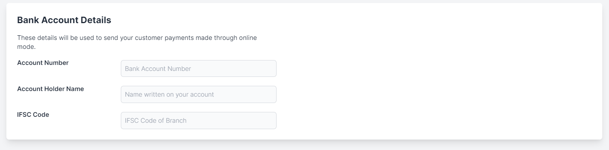
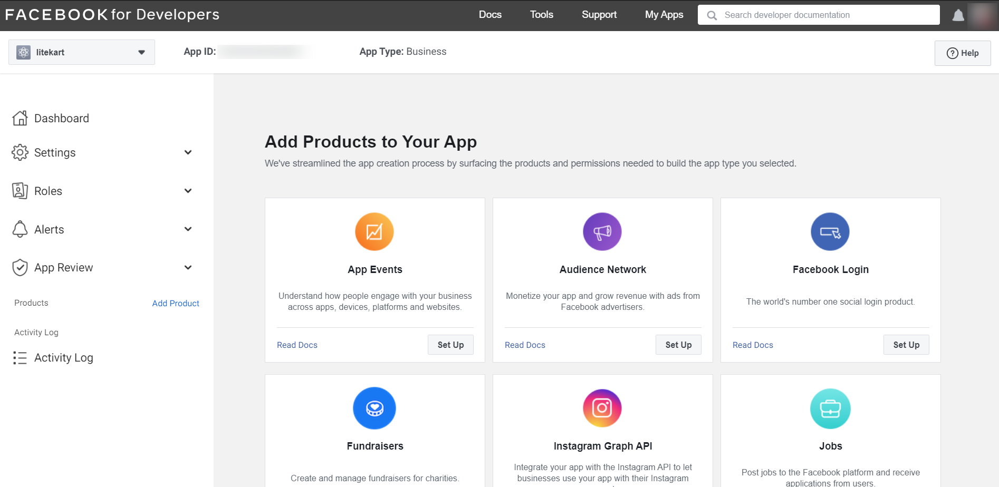

# Admin Manual

## Getting started

Anne is a E-Commerce platform that allows anyone to set up an online store and sell their products. Administrator will have enormous number of features from where he/she can control the flow of the anne.

This guide will help you through the basic steps to open your Anne store and start selling within a day. Once you sign up and set up your store, you don't have to do anything else — your store is up and running. Meaning it's open, and customers can check your storefront and make orders.

Okay, let’s get started!

### SignUp

- You can sign up to Anne Platform on your browser. All you need is an valid email address, and You can set up account.
- If you are not registered to website then you can create a new account using sign up.
- After filling all details, click on `sign up` button, after this server will check the provided info is valid or not, if it is valid then it will create your account or if it detects that the info is invalid then you have to fill the details carefully.
- Email must be unique, not registerd with us already.
- You can fill details as in image below

### Sign In And Sign Out

- You can log in to Anne on your browser.

**To log in**

- Go to the Anne admin panel login page.
- If you signed up with an email address and password, enter them and click `Sign In`.
- password should be case sensitive.
  

**To log out**

- Go to your Anne admin panel at [https://admin.anne.biz/](https://admin.anne.biz/)
- Click on your left sidebar bottom at logout.

### Resetting Password

- You can reset your login password any time if you forget it, or if you want to keep your account more secure.

**To reset your forgotten password**

- Go to [https://admin.anne.biz/](https://admin.anne.biz/)
- Click on `Forgot password`
- Enter email address which is associated with your Anne account and click `Send email`.

  

- An email with a link will sent you for reset your password. In the email, click on reset password link.
- Create a new password for your account and click `Reset password`
- Now You will be able logged in to your Anne account with your new password.

  

<!-- ### Store Set Up

- After Successfull signup, it will redirect to Store set up page , it will ask for the store configuration.

The fields shown above have to be filled by you to open up a new shop and after store set up you will be able to access the store feature. -->

## Configurations

Before your platform goes live you need to configure the platform to set everything right and make it usable with no issues. In this section, you will set branding, configure Payment Provider, Email Service, Search Service provider, Newsletter, google analytic, Social Media login, etc. To do some configuration you may have to modify few config files in the system. Check this guide to know how to modify the .env environment file.

- In sidebar , go to Settings → Store Settings.

### Email Configuration

By default, the system is set up to log all mails into files. You have to configure this settings to send emails. You may use any of this supported services→ sendmail, mailgun, mandrill and sparkpost. To configure email, open the .env file and update these keys with your values.

::: warning

> The system will generate errors if the mail fails. So double check the email configuration. Talk to your email/hosting service provider if you’re not sure what to do.

:::

#### Testing Emails

If you don’t have a mail server or just testing the application you can fake the actual sending of emails. zCart has a log driver and the Mailtrap driver for this job.

**Log Driver**

Instead of sending your emails, the log mail driver will write all email messages to your log files for inspection. All emails will be stored in storage/logs/zCart-date.log files. The default email driver is log, so you don’t have to do anything to configure this driver.

**Mailtrap**

Finally, you may use a service like Mailtrap and the smtp driver to send your email messages to a “dummy” mailbox where you may view them in a true email client. This approach has the benefit of allowing you to actually inspect the final emails in Mailtrap’s message viewer.

- MAIL_DRIVER=log
- MAIL_HOST=smtp.example.com
- MAIL_PORT=587
- MAIL_USERNAME=user
- MAIL_PASSWORD=secret
- MAIL_ENCRYPTION=tls
- MAIL_FROM_ADDRESS=no-reply@example.com
- MAIL_FROM_NAME=No-Reply
- MAIL_REPLY_TO_ADDRESS=reply@example.com
- MAIL_REPLY_TO_NAME=Reply

The MAIL_FROM_ADDRESS and MAIL_FROM_NAME will be used to sent email by your marketplace where no specific sender information available to use.

### Store Settings/System Settings

This is the time to configure your brand information and platform details. In this section, you can upload the logo and icon image, set the marketplace currency, active business area, system timezone, default language(visitors can still switch the language on the front-end), your business address, etc.

#### Store Profile

- In Store Settings, you will redirect to store profile.

##### Store Name and Web Address

- Your store name is the name under which your store appears to customers.
- Your store location defines which web address is displayed on customer-facing invoices and emails, and is also used when sharing products via social networks.

##### Store Currency

- You can add currency name and currency symbol.

##### Company Name and Email

- The official name of your business. If you don't have a registered business yet, specify your store name as the company name.
- You can also add email of the company.

##### Company Address

- You can fill your company address here with phone number.
- You can also search your store location in search address field.

##### Social Media Accounts

You can provide your social media url of your store, so customer can easily visit your store and its products.You can link account as follows

- Facebook
- Instagram
- Linked In
- Twitter
- Youtube
- Pinterest
- Google

##### Storefront is Open

In case you want to store status from open to close with a note, you can use this feature.

##### Custom Domain

- A domain is a unique address of your website on the Internet. People use the domain to locate and visit your site. Besides, it defines your brand and produces an instant, but lasting impression. It also affects your site position in the search engine results as the right keywords in your domain name improve your SEO ranking.

- If you already own a domain name, go ahead and connect the domain to your Anne Instant Site. In case you don't have one yet, you can buy a domain from any third-party company that sells domain names.

##### Store Description

- Information about your store. You may also use videos, images, and animated elements that help to describe your store. Write unique description for rank higher in search engines.

- Store description section has the editor, so you can easily add text (and change color, size, and font), bullet points, paragraphs, links, or additional images and videos.

- Tips to improve your store descriptions

  - Avoid long sentences and complex vocabulary.

#### Store SEO

SEO (or Search engine optimization) is the process of improving your site's ranking in search results in engines like Google, DuckDuckGo to generate free traffic to your online store. While some things can be manual, Anne has the technical side covered for you –– all stores are optimized for search engines by default.

##### Preview

- You can preview store through this link.

##### Company SEO Attributes

- You can add company SEO attributes like- tile ,metadescription etc.

#### Store Images

You can upload images of the store , logo of your store and youtube video and more.

#### Store QR Code

- Your Anne store QR Code is generated as soon as you create your store.
- You can share and download your QR Code from the sidebar settings → store.

#### Store Bank Account

In This section store owner can fill account details, so order amount reflect in that account.

### Store Payment

This section allows you to control payment on store. By configuring payment you can perform the common task of processing payments on seller's behalf.

- In sidebar, go to Settings → Payment.
- You can choose payment gateway's from here.

#### Cashfree

You can easily collect payments from your customers using cashfree. Cashfree Payment Gateway accepts domestic and international payments. You can easily collect payments using popular Payment Methods like Cards, UPI, Netbanking, Wallets, PayPal, EMI, and Pay Later options.

##### Create Account

To get started with Cashfree you must first create an account. To create an account,

1.Go to the Cashfree website and click Create Account.
2.Enter your Work Email Address and enter a password for your Cashfree account in the Create Password field. You will need this password to login later.
3.Accept the terms and conditions and click Next.
4.Enter your company details, i.e, your company Contact Number, Website URL/Application Link, and your Monthly Transaction Volume (INR). Click Next.
5.Select one or more solutions that you looking for.
6.Click Complete Signup. You will receive a verification email. Click the link in the email to verify your email address.
7.Sign in to your Cashfree account using the credentials.

##### Merchant Home Page

By default, you are in the test environment. Click SWITCH TO PRODUCTION to access the live environment.

##### Account Activation

You must activate your account to access the production environment. To activate the account, you must first fill in details about your business and upload and submit the required documents.

Follow the steps below

1. Sign in to the Merchant home page and click ACTIVATE on the desired product.
2. Fill in the details and submit. These details will be sent for verification.
   After successful verification, you can access the production environment for your business transactions.

Information to be provided as part of the activation process is available below.

General Information

Business Address

If your business address and GST registered address are different, clear the checkbox in the above screen and enter the GST registration address.

Bank Details

KYC Details

The KYC information required differs based on the business type selected.

##### My Account

My Account section gives you control of overall activities around your account. You can control some of the basic account settings, two-factor authentication, security preferences, configure email notifications, manage users/aliases to provide access to the dashboard and monitor login history.

To add a new alias

1. Select your product > click User/Alias > click NEW ALIAS.
2. Provide the Username, alias Name, Country, Phone, and Password.
3. Select the status Active or Inactive for the new alias.
4. Click CREATE ALIAS.

##### API Keys

1. To generate or view your Test and Production API Keys, go to www.cashfree.com > click Login > enter your Email ID and Password provided during the signup process.
2. Select the product that you are integrating with > click Credentials in the Product Dashboard.
3. For authentication purposes, you need to re-enter your password. The Production and Test API keys are shown.

#### Stripe Connect API

Stripe Connect enables you to control credit card payment on behalf of merchant’s connected accounts. By configuring Stripe Connect API you can perform the common task of processing payments on a seller’s behalf. You’ll need CLIENT ID, SECRET KEY, PUBLISHABLE KEY and WEBHOOK SECRET from Stripe.

> INFO Once the Stripe connect is configured. The same APIs can be used for vendor subscription billing, no extra configuration needed.

##### Register Your Platform

Very first you have to register your marketpalce platform with Stripe. Login into your Stripe dashboard and go to the Connected accounts section. Click Get Started button to activate connect account.

Stripe Dashboard

On next window, select Build a platform or marketplace option and proceed.

Dashboard Stripe 2
Choose Build a platform or marketplace

Go to Settings from the sidebar and click Connect Settings.

Stripe connect settings

On the next screen Integration section get the client ID, we’ll need this ID later on this guide. Enable the OAuth settings based on your account type, If you’re confused then enable both. Now click Add URI button and give https://your_domain/admin/setting/stripe/redirect in the Redirect URI field.

Stripe connect settings

On the same screen scroll to Branding section and fill the form with your brand information, upload logo, and icon.

**Get API credentials**

Next, go to Developers API keys section from the sidebar and get the Publishable key and Secret key.

**Handling Stripe Webhooks**

One more thing is remaining to finish configuring the Stripe side. And that is webhooks. By setting webhooks we allowing Stripe to communicate with your platform when any changes happen on Stripe’s site like subscription update, cancel, payment failed, etc. so that your marketplace can take actions to manage the vendor account on your marketplace. zCart has everything configured for you, now you just have to set the URL and the secret key for secure communications.

Go to Developers Webhooks section from the sidebar and click the Add endpoint button. On the next window enter https://your_domain/stripe/webhook in the Endpoint URI field and add below events on the Events to send section.

Stripe Webhooks Events

Events need to enabled

- customer.subscription.updated
- customer.subscription.deleted
- customer.updated
- customer.deleted
- invoice.payment_action_required

After adding the webhook endpoint URL and events. Open the endpoint details and get the Signing secret value to secure the communication.

Stripe webhooks secret

You have done Stripe connect API configurations, please open the .env file and update these keys with your values.

- STRIPE_KEY=your_stripe_publishable_key
- STRIPE_SECRET=your_stripe_secret_key
- STRIPE_CLIENT_ID=your_stripe_client_id
- STRIPE_WEBHOOK_SECRET=stripe_webhook_signing_secret

From now the application will automatically handle canceling subscriptions that have too many failed charges (as defined by your Stripe settings), customer updates, customer deletions, subscription updates, and credit card changes.

Now your marketplace can use Stripe APIs to manage payments. But still, we’re not done. You need to create subscriptions and prices on the Stripe dashboard and also in your marketplace dashboard to charge vendors. Please check this section of the documentation for help.

> Note! Enable View test data to get test credentials on the Stripe dashboard.

::: warning

> The stripe platform account and the connected account (seller) can’t be the same account. To test stripe connect use different accounts.

:::

Now from your platform’s admin Dashboard navigate to SETTINGS CONFIGURATION PAYMENT METHOD tab and enable Stripe payment method so that your marketplace vendors can accept credit card payment.

## Optional Configurations

This section will guide you to configure some optional modules. This is not mandatory configurations for your marketplace but to allow you to make it more personal. Like you can set what will be the color of order invoice generated from your marketplace.

<!-- ### Full-text Search with Algolia/Configure Algolia Search

The system has a built-in search functionality and pre-configured to enable full-text search. But if you’re a fan of Algolia, of course you can use your favorite search provider.

Info! Algolia is a premium service and may cost you to use the service! Check the Algolia site for more info.

To configure Algolia, you need your algolia APP ID and SECRET KEY from Algolia. Head to your Algolia dashboard and go to the API keys section. You’ll find the API keys there. Now open the .env file and update these keys with your values.

- SCOUT_DRIVER=algolia
- ALGOLIA_APP_ID=YourApplicationID
- ALGOLIA_SECRET=YourAdminAPIKey

You don’t have to do anything more. The application will take care of everything you need to index your data to Algolia. -->

### Social Media Login

The system is integrated with Facebook and Google+ to allow social media login for Customers. You have to configure your marketplace to use this feature.

#### Facebook Login

To enable Facebook login, go to the [Facebook Developer](https://developers.facebook.com/apps/) site and create an app for your marketplace. Now login into your developer account Dashboard. From the list of products select Facebook Login and click the Set Up button.

On the next screen select Web and then on the coming screen just give the Site URL and click Save. Ignore the rest of the options and go to the Settings > Basic from the sidebar. All the API credentials you need are here, get the App ID and App Secret. Fill the form with your marketplace information and Save Changes.

Now go to the Facebook Login > Settings from the sidebar. Enable Client OAuth Login and Web OAuth Login. After that give the callback URL like https://your_domain/customer/login/facebook/callback on the Valid OAuth Redirect URIs input field. Customers will be redirected to this URL after authentication. You can ignore the rest of the settings and click Save Changes.

The last part of this section is to turn on the Facebook App to use it. You can do it from the top on the same screen. To finish the integration open the .env file and update these keys with your values.

- FB_CLIENT_ID=your_fb_client_id
- FB_CLIENT_SECRET=your_fb_client_secret
- FB_REDIRECT_URL=redirect_url

#### Google+ Login

Like Facebook, you need to have a project at Google Developer account to get API credentials. If you already configured Google Analytics then you can use the same project. If you need help how to create a project on Google check here and come back this point. Head over to Google API’s site and Select your project. This time finds and enables Google+ API on the API list.

Now go to the Credentials in the sidebar. Click OAuth consent screen tab and fill out the details there.

Now on the same screen go to the Credentials tab on the left. Click Create credentials and choose OAuth client ID from the dropdown list.

In the OAuth client ID screen, select the type of application, give origin and callback URLs like `https://your_domain/customer/login/google/callback`

Get the Client ID and Client Secret in the credentials page. Now open the .env file and update these keys with your values.

- GOOGLE_CLIENT_ID=your_project_client_id
- GOOGLE_CLIENT_SECRET=your_project_client_secret
- GOOGLE_REDIRECT_URL=redirect_url

Social login configuration is done. Now customers will be able to login using Facebook and Google accounts.

### Image Management

We use Imagekit.io for image optimization, so that exact size images will be delivered keeping the whole app performant

### Imagekit setup

- Create an account at imagekit.io
- Navigate to External Storage

- 1. Add new S3 origin

  - Name it S3
  - Select origin type = Amazon S3
  - Enter S3 credentials in the provided textboxes
  - Click submit

- 2. Add new filesystem origin

  - Name it Filesystem
  - Select origin type = Web Folder
  - Base URL = http://anne.biz
  - Click submit

- Click on URL endpoint at the imagekit sidebar
  - Click on Add New URL endpoint
    - Enter identified
    - Select origin preference in the following sequence
    - 1. S3
    - 2. Filesystem

The filesystem is the disk space where the application store all the images and other static files. The system provides a powerful filesystem abstraction. The Filesystem integration provides simple to use drivers for working with local filesystems, Amazon S3 and Azure Cloud Storage. Even better, it’s amazingly simple to switch between these storage options.

By default, the platform uses the local public disk. The public disk uses the local driver and stores these files in storage/app/public.

> INFO: To make them accessible from the web, you should create a symbolic link from public/storage to storage/app/public. Most of the case the system will just work out of the box but few servers may cause problems creating the symbolic link.

To change the default filesystem, open settings and in settings choose storage provider. You can Change the file storage from local to s3 and azure.

#### Amazon S3 Configuration

To configure S3, get your own S3 configuration and credentials. Now open the .env file and update these keys with your values from Amazon S3. For convenience, these environment variables match the naming convention used by the AWS CLI.

- S3_ACCESS_KEY
- S3_SECRET
- S3_BUCKET_NAME
- S3_REGION
- CDN_URL

#### Microsoft Azure Storage

Follow the azure Docs to obtain your own connection string, account name, access key, and cdn url. Then update these credential's with your values from microsoft.

- AZURE_STORAGE_CONNECTION_STRING
- AZURE_STORAGE_ACCOUNT_NAME
- AZURE_STORAGE_ACCOUNT_ACCESS_KEY
- AZURE_STORAGE_CDN_URL

### Invoices

The system has a built-in PDF library to generate beautiful invoices for purchases made on the platform. Customers can download the order invoices from their order detail page. You can configure your preferences for invoices like the Title, paper size, and color, etc.

The platform is all set to generate nicely formatted invoices without any configuration needed. To set your own preferences please open the config/invoice. file and change the default settings.

The default configuration:

    /*
    |--------------------------------------------------------------------------
    | Title
    |--------------------------------------------------------------------------
    |
    | Keep it empty to use the default title 'Invoice' that comes from language file.
    |
    */

    'title' => '',

    /*
    |--------------------------------------------------------------------------
    | Color
    |--------------------------------------------------------------------------
    |
    | Set primary color in hex
    |
    */

    'color' => '#007fff',

    /*
    |--------------------------------------------------------------------------
    | Document size
    |--------------------------------------------------------------------------
    |
    | Supported document size values are A4, letter, legal
    |
    */

    'size' => 'A4',

By default, the system uses paper size A4 and and title Invoice. You can also set the invoice color here, use hexadecimal color code.

TIPs: Keep the title empty to use to allow the script to pick the title from the translated file.

### Google Analytics

The application has a basic visitor analytics system builtin. But if you want to use Google Analytics then the application can get your Google Analytics data on your admin dashboard and report section in place of the built-in system. By configuring Google Analytic API you can see Page views, Sessions, Unique visits, Referrals, and Behaviors of visitors on your marketplace admin dashboard. Before enabling Google Analytics you must configure the application correctly to get the Analytics data.

::: warning

Enabling Google Analytics can cause errors if not configured or misconfigured!

:::

#### Get API credentials

The first thing you’ll need to do is to get some credentials to use Google API. I’m assuming that you’ve already created a Google account and are signed in. Head over to Google API’s site and Select your project. If you don’t have any then create a new project and select. Now click ENABLE APIS AND SERVICES on the Dashboard section.

Next, in the list of available API’s select Google Analytics API. On the next screen click ENABLE button.

Now that you’ve created a project that has access to the Analytics API it’s time to download a file with these credentials. Click Credentials in the sidebar. Click Create credentials and choose Service account key from the dropdown list.

On the next screen click over the New service account field and give the service account a name on the Service account name field and set the Role as project Owner. You can name it anything you’d like. Copy the email address in the service account id, we’ll use this email address later on in this guide. Select JSON as the key type and click Create button. A JSON file will be download to your computer, we’ll use this file to connect with Google.

Now you have the API credentials on your local computer’s download location. Rename the file to analytics-api.json and upload to the file to your project at the ../storage/app/ directory.

#### Grant permission and Get the View ID

If you don’t have a Google Analytics account, create one from Google Analytics site. Go to Admin section from the sidebar and click User Management

Now click the button and then select Add new users

On the next screen in the Email addresses field paste the client_email email address from the analytics-api.json we got from the Google API site. Check the Read & Analyze and click Add to finish.

> TIPS: If you forgot to copy the service account id email address, you can get it from the JSON file you downloaded in the previous step.

Go back to Admin section again and click View Settings. We need the View ID displayed there.

Open the .env file and update ANALYTICS_VIEW_ID with the value you got from Google.

- ANALYTICS_VIEW_ID=your_view_id

We’ve done the Google Analytics configuration and ready to view the Analytics on the application Dashboard. To enable Google Analytics navigate to:

SETTINGS → CONFIGURATION → REPORTS

> Note: Only admin level user can see Google Analytics reports.

## Appearance

This article will help you to change the storefront theme as well as merchant landing themes. You can create banners, sliders and manage theme with easy to understand interface.

### Banners

Banners are used to make your store attractive to the customers.These banners contain image of sales, discounts and more.

**Anne store have four types of banners as follows**

- Slider→ This section controls the main page slider.
- Hero→ This banner used for page medium content.
- Picked→ This banner will comes in smallest and can use for brands.
- Video→ This banner contain video.

**Create Banner**

- Click on plus icon for create new banner.
- Choose image and fill detail.
- Banner type will decide the banner look and position.
- Banner link will redict user to page on that link.

**Banners List**

- You can edit,clone and delete banner from here.

**Banner Export**

You can export all yours banners in the csv format by going to the manage banners page where the banners grid is displayed. On the right corner of the grid there is an excel logo from where the you can export the csv which will have grid columns.

## User Management

There are two types of users on the system, platform users who manage the marketplace and merchant users belong to a vendor to manage their store. All users get access to different modules based on the permission given by their role they belong. Only the super admin has full control over the system and the merchant has full access on his/her store. Also, merchant type users can get access to some platform modules permitted by the platform.

> Info! You can not access or modify users who have more privilege than you. You can only create users with less privilege than yourself.

### User Roles

A user must have a role to get access to this system. You can create a user role that belongs to the platform or merchant. Platform type roles can be permitted to access platform modules and common modules like category module and tax module. Vendor admin can create users using merchant type roles to manage their store. You can also allow vendors to create their own user roles with own permission set.

### Create Users

You can add an unlimited number of users. A user created on the platform admin panel can be assigned to a platform type role. The store owner can add staffs from merchant admin panel to manage their store.

> TIPS: To assist vendors to add staff to their store, platform users can login to vendor account if permitted.

## Catalog

The catalog is combined of product, category, product attribute and manufacturer modules. With the help of this modules, you will be able to manage your marketplace product catalog effortlessly. All the functionalities you need is there.

### Categories

- Categories is an important and essential feature which provide a relief to the customer to select and shop according to their requirement. A product can belong to multiple categories at a time. (for example, Fashion,Electronics )

- Categories uses tree structure mean categories are defined on several levels. And toppest level categories called as root categories. You can create root categories,and then also create categories on second, third, etc. level within your root category. They are referred to as subcategories or child categories.

- You will see all categories in tree structure. And by clicking on any category you will be able to edit the category.

#### Create category And Edit category

- In sidebar, go to Products → Categories.
- Click Add New Category.

- Fill the category details as per your need.

- In case you want to create a root category, you don't have to select parent category field.
- In case you want to create sub category , you can choose a parent category.

- Click Category image to upload an image for your category. You can upload an image that represents your category or an image of a product from the category.

- Enter the description. You can describe what kind of products are in that category, or just leave it blank.

-And you can also enable category features like- megamenu,active.

- Edit category is same as create new category, just select the category in tree which you want to edit. Now you can update fields.

### Brands

In the brand section there are the brands of the different product that are available in the store can be seen.
Brand used for better navigation in product for customer.

- In sidebar, go to Products → Brands.

**Create new Brand**

- Click on plus icon for create new brand.
- Now you can fill fill form of brand, you can also provide social media link of the brand.
- You can also upload image of the brand.
- Click on save icon at right side of bottom.

**Brands List**

- You can edit,clone and delete brand from here.

**Brand Export**

- You can export all yours brands in the csv format by going to the manage brands page where the brands grid is displayed. On the right corner of the grid there is an excel logo from where the you can export the csv which will have grid columns.

### Sizes

In the size section there are the sizes of the different products. Its like variant of the product , means single a product is available in multiple sizes.

- Customer can choose the product size accoring to his/her need.

- In sidebar, go to Products → Sizes.

**Create new Size**

- Click on plus icon for create new size.
- Now you can fill fill form for size details.
- Click on save icon at right side of bottom.

**Size List**

- You can edit,clone and delete size from here.

**Size Export**

- You can export all yours sizes in the csv format by going to the manage sizes page where the sizes grid is displayed. On the right corner of the grid there is an excel logo from where the you can export the csv which will have grid columns.

### Products

- You can upload products in bulk using a CSV-formatted import file.
- In Product list page, click on `Import Products`.
- It will redirect you to product import page. There you can import csv file.

### Popular Searches

Popular Searches used for better navigation in product for customer.

- In sidebar, go to Products → Popular Searches.

**Create new Popular Searches**

- Click on plus icon for create new popular Search.
- Now you can fill name and popularity.
- Click on save icon at right side of bottom.

**Popular searches List**

- You can edit,clone and delete popular searches from here.

**Popular Searches Export**

- You can export all yours popular searches in the csv format by going to the manage popular searches page where the popular searches grid is displayed. On the right corner of the grid there is an excel logo from where the you can export the csv which will have grid columns.

## Import And Export

- In import you can add product and category in bulk.

- The product bulk upload feature will help you to import your old product list into your catalog system. There is a CSV template to help you, this template is like a sample, use the template to prepare your product list.

- In Export you can get data in csv format file and also able to download it.

### Import Product

- Product create one by one take a lot of time so for add product in bulk import product comes handy.
- Product import in store through is the fastest way to upload catalog or make bulk changes to products in an existing Anne store catalog.
- When importing, Anne converts the data from the uploaded import file into products in your online store.
- Only CSV format file allowed to import.
- You can also see the sample import file format.

- Once you’ve prepared your CSV file, you can import it into your store

  - In sidebar, go to Import/Export → Import Product.
  - Click Import Products.
  - Click Choose file and select the CSV file from your computer.
  - After Sumit file wait for somtime and you will see all products thorough import details.

::: warning

The first row of the template CSV file is the header. Don’t change this row. The system needs this row unchanged to populate the product into the database.

:::

In csv some fields are mandatory as shown below

1. `barcode or sku` → barcode or sku one of them is mandatory in each raw, otherwise it will show error like barcode and sku not provided.
2. style_code → style_code is provided via vendor for each item.
3. `ean_no` → EAN / UPC Number is used for European Article Number.
4. `article_code` → article_code is provided via vendor for each item.
5. `product_master_id` → product_master_id is used to group same product with diffrent options. like- color, size etc. It will defined via vendor.
6. `name` → name is provided via the vendor for its better navigation.
7. `description` → short desciption of product.
8. brand_id and brand →

- brand is used for brand name and brand_id is used for unique brand id which provided via vendor.
- In case you want to add brand in product you have to provide both, otherwise brand will not assign to product.
- If you provide both of them then it will look for brand, if not found then create brand and will assign to product.

9. categories →

- categories are pipe(|) seprated multiple category id's, which defind via vendor. You can also provide single id.
- In case you provide at least one category id , it will look for category. And if categories found then assined to product.
- In at least one category found case, it will automatically choose category from categories.

10. `mrp` → mrp is a marketing price , which can not be negative.
11. `price` → mrp is a selling price , which can not be negative.
12. `hsn` → hsn is Harmonised System of Nomenclature code and it is mandatory in country india. In other country it is not mandatory.
13. tax → payable per unit of good or service product.
14. color and color_code →

- Color is used for color name and color_code is used for unique color code.
- It will look for color via color code and if not found then it will create color.
- At last it will assign color to product.

15. size →

- you can provide any size to product.
- It will look for size via its name and if not found then create a new size.
- At last it will assign size to product.

16. gender → gender can be male, female or unisex.
17. `currency` → currency is used for country currency.
18. `vendor_phone`, `vendor_email` and `vendor_name` → vendor info in mandatory, if not passed then it will assign logged in user to product as vendor.
19. `manufacturer` → manufacture means where the product is manufactured.
20. key_features → key_features is a pipe(|) separated list of features.
21. product_specifications →

- product_specifications is provided as pipe(|) separated and inside it :: separated.
- It will look specifications and in case not found then it will create new feature.
- At last it will assing specifications to product.

22. product_details →

- product_details is provided as pipe(|) separated and inside it :: separated.
- It will look details and in case not found then it will create new feature.
- At last it will assing details to product.

23. return_info → return_info is text value of return policy.
24. `country_of_origin` → It is the country of origin of the product.
25. `featured image` and images →

- Images is comma(,) separated list images.
- It will upload images into respected servers.
- It will automatically choose the 1st image insdie images as `featured image` (img).
- When `featured image` provided and images not provided, it will pick img and push to images array.
- When `featured image` and `images` both are provided, where as `featured image` does not contain inside images array, it will ignore `featured image`

> Note - while uploading image, restricted platfrom url not allowed, like google dive and dropbox

26. condition → condition can be new, old or refurnished.
27. gtin → Global Trade Item Number (GTIN) is a unique and internationally recognized identifier for a product.
28. stock → In case of inventory updation you can provide stock in numbers.
29. item_id → item_id is a unique id of product which is defined via vendor.
30. warranty → warranty is info about product warranty in text.
31. age_min,age_max and age_unit → age parameters are used for age group.
32. keywords → keywords are used for better product search.
33. type → type can be physical or digital.
34. replace_allowed, return_allowed and return_validity_in_days → return and replace info about the product.
35. metaTitle and metaDescription → The meta title and description tags are part of the HTML code on each product page and can be optimised separately for search engines. The meta title and description SEO explain to the search engine what this page is relevant for and for which terms it should rank

36. sizechart → it is a image of sizechart. images will upload in respected servers.

> In csv if any raw field contain `DELETE` then that perticular field will be deleted from that product.
> HighLighted fields are mandatory.

#### Import Details

- Import detail is at the same page of import product.
- You can see each raw information of the product ,like what happen to what raw.
- At the time of tracking you can also refresh the details by clicking on refresh button at right bottom corner.

### Import Category

- Import Category is same as import product, in case you want to add categories in bulk you can use this.
- Import Category sample format link also there.
- In sidebar, go to Import/Exxport → Import Category.
- When you csv file ready then choose file and upload it.

::: warning

The first row of the template CSV file is the header. Don’t change this row. The system needs this row unchanged to populate the product into the database.

:::

In csv some fields are mandatory as shown below

1. `category_id` → category_id is used for category Id , which is unique provided by vendor.
   It will look for category and if not exist then create category with name.
2. `category` → category is used for category name.
3. parent_category_id → parent_category_id is used for category Id , which is unique provided by vendor.
   It will look for category and if not exist then create category with name.
4. parent_category → parent_category is used for parent category name.
5. img → img contain the image link, image will upload into respected server.
6. active → category info about its activation.
7. position → position is used for sorting of categoies.
8. megamenu → megamenu is used for meagamenu activation of category. means category will be liste in megamenu or not.
9. featured → featured is used for category. means category will be shown to customer or not.
10. shopbycategory → shopbycategory will allow customer to filter products via category.
11. brand_id → brand_id contain the unique brand Id which provided by vendor. It will look for brand and if found then assign it to category.
12. level → level are used to locate the category level, because its uses tree level approach.

::: warning

Category use level wise approach, Categories must be increasing format of level. Parent must comes before its child.

:::

### Export

- Whenever you want to take a backup of your store , in that case you can use export feature.
- This feature will export file in csv format. And you can upload this file to anne.
- You can export Products, Brands, Categories, Features, Sizes, Users and Orders.
- You can apply filters and you can export data as per your choise.
- When you click on Export All, automatically a csv file will download into your system with data.

## Discounts

Offering a discount is the best way to get attraction from buyers. You can create an unlimited number of coupons for your store and you have full control over the promotions. You can set the validity time period, total quantity, how many times a single buyer can get the discount and more control. The coupon value can a fixed amount or a percentage of the total order amount.

**Coupon for specific customer/s**
You can create coupons that can be used by a single customer or specific group of customers. To limit the coupon to customers check the LIMITED TO CUSTOMERS option and select customer/s.

**Coupon for specific shipping zone/s**
You can create coupons that can be used by the customers from a specific shipping zone of zones. To limit the coupon to shipping zone check the LIMITED TO SHIPPING ZONE option and select shipping zone/s.

## Support Desk

The system has built-in module for customer support Messages

### Messages

A messaging module where you can receive messages. The message module design to receive communications from customers (customer-merchant and customer-platform).
The contact us form messages will be in platform inbox.

<!-- ### Refunds

When a customer opens a dispute he/she can also request for a partial or full refund of the order total. You can also initiate a refund for an order from your admin panel.
If you’ve proper permission, you can either approve or decline the refund request in this section. -->

## Utilities

Utility is an important characteristic of business is the creation of utilities is goods so that consumers may use them.

### Blogs

- A blog is a discussion or informational of store features.
- In sidebar, go to Utilities → Blogs.
- You will see the list of blogs here.

**Create/Edit Blog**

- For create blog click on add icon at the bottom of right side, and it will redirect to blog edit page.
- Now you can able to create blog.
- For edit blog click on pencil icon of blog on the listing page and you will redirect to blog edit page.
- After update details click on save icon.

**Blog Export**

- You can export all yours blogs in the csv format.
- Click on top right corner at excel logo of the listing page.
- And a csv formatted file will download in your system, which will have data in grid columns.

### Frequently Asked Questions (FAQ)

- FAQ's are series of questions paired with answers, that provides basic information.
- These are very helpful for customers to find their resolutions easily.
- In sidebar, go to Utilities → FAQ.

**Create/Edit FAQ**

- For create FAQ click on add icon at the bottom of right side, and it will redirect to FAQ edit page.
- Now you can able to create FAQ.
- For edit FAQ click on pencil icon of FAQ on the listing page and you will redirect to FAQ edit page.
- After update details click on save icon.

**FAQ Export**

- You can export all yours fequently asked questions in the csv format.
- Click on top right corner at excel logo of the listing page.
- And a csv formatted file will download in your system, which will have data in grid columns.

