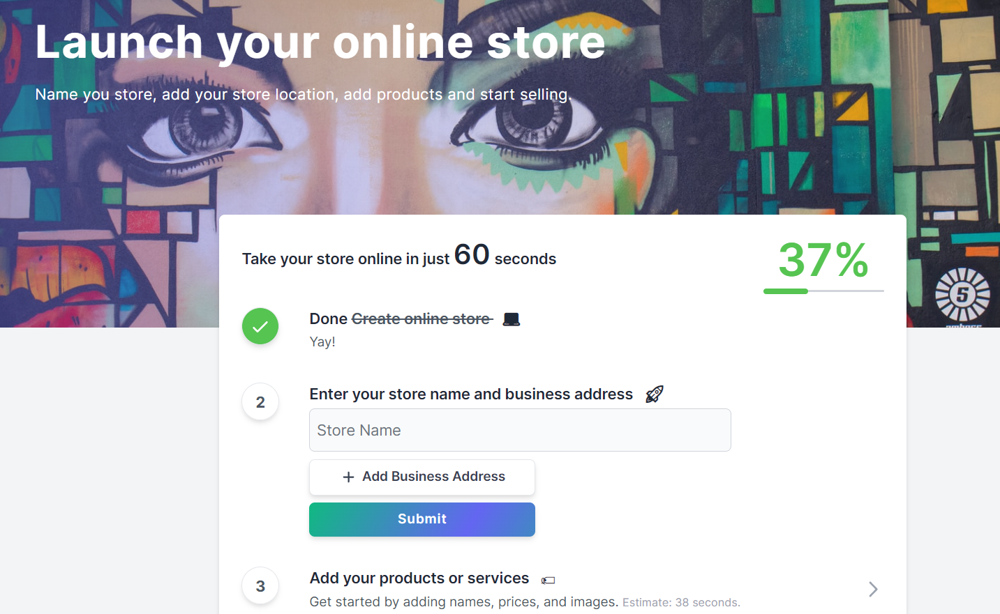
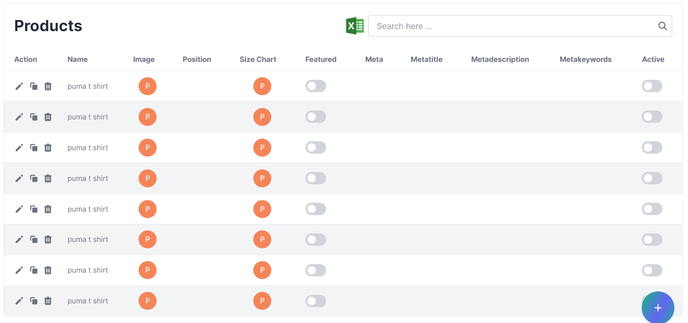

# Admin Manual

## Getting started

Anne is an E-Commerce platform that allows anyone to set up an online store and sell their products. The administrator will have an enormous number of features from where he/she can control the flow of the Anne.

This guide will help you through the basic steps to open your Anne store and start selling within a day. Once you sign up and set up your store, you don't have to do anything else — your store is up and running. Meaning it's open, and customers can check your storefront and make orders.

Okay, let’s get started!

### SignUp

- You can sign up to Anne Platform on your browser. All you need is a valid email address, and You can set up an account.
- If you are not registered to the website then you can create a new account using sign up.
- After filling in all details, click on `sign-up button, after this server will check the provided info is valid or not, if it is valid then it will create your account, or if it detects that the info is invalid then you have to fill the details carefully.
- Email must be unique, not registered with us already.
- You can fill in details as in the image below
- Store owner's role is admin via default when he/she create a new store.

### Store Set Up

- After Successful signup, it will redirect to Store set up page, it will ask for the store configuration.

The fields shown above have to be filled by the admin to open up a new shop and after the store is set up, you will be able to access the store feature.

### Sign In And Sign Out

- You can log in to Anne on your browser.

**To log in**

- Go to the Anne admin panel login page.
- If you signed up with an email address and password, enter them and click `Sign In`.
- password should be case-sensitive.
  

**To log out**

- Go to your Anne admin panel at [https://admin.anne.biz/](https://admin.anne.biz/)
- Click on your left sidebar bottom at logout.

### Admin for existing store

- If you want to become an admin for an existing store, Then you need to first register as a vendor and the super admin will assign you a store and update your role in the store.

### Dashboard/Reports

When you logged into your account, you will redirect to the dashboard page. The menu page will be listed in the left corner of the page & the 1st option that will be opened is Dashboard.

In the Dashboard, there are different reports that admin can see such like

**Statistics**

- Total Orders → Total how many orders have been placed from the store will be shown here as a count.
- Total customers → Total how many users ordered store products will be shown here as a count.
  > A user can count only one time, however, he/she placed multiple orders.
- Total products → Total how many products in-store will be shown here as a count.
- Total payments → Total how many payments are done in-store will be shown here as a count.

**Earning** → It will show the total amount of orders placed in a month in store.

**Latest Orders** → This box will show the latest five orders placed in the store. The latest orders will have a different background color based on the order status.

**Instructional Videos** → This box has a video list, how things work in the panel.

**5 Top Vendors** → This box has a list of top-selling vendors in the store. On top highest selling amount vendor and at bottom lowest selling amount vendor.

**Transactions** → This box will show the latest five payments in the store.

### SideBar

- Anne's sidebar is a useful component of website navigation design. The admin can see all the services in one place through the Anne sidebar, also can manage as per need.

### Profile

- In the sidebar, go to My Profile → profile.
- Here admin can update profile information.

- admin can add its address, This address will use for pick-up locations.

- admin can add bank account details.

> Please make sure details are correct because these details will use in case of payment withdrawal.

- admin can also close the account from here.

### Change Password

Admin can change login password via entering a current password and new password. And after successful change admin will receive a confirmation email.

### Resetting Password

- You can reset your login password any time if you forget it, or if you want to keep your account more secure.

**To reset your forgotten password**

- Go to [https://admin.anne.biz/](https://admin.anne.biz/)
- Click on `Forgot password`
- Enter the email address which is associated with your Anne account and click `Send email`.

  

- An email with a link will be sent to you for resetting your password. In the email, click on the reset password link.
- Create a new password for your account and click `Reset password`
- Now You will be able to log in to your Anne account with your new password.

  

## Configurations

Before your platform goes live you need to configure the platform to set everything right and make it usable with no issues. In this section, you will set branding, configure Payment Provider, Email Service, Search Service provider, Newsletter, google analytic, Social Media login, etc. To do some configuration you may have to modify a few config files in the system. Check this guide to know how to modify the .env environment file.

- In the sidebar, go to Settings → Store Settings.

<!-- ### Email Configuration

By default, the system is set up to log all emails into files. You have to configure this setting to send emails. You may use any of these supported services→ sendmail, mailgun, mandrill, and sparkpost. To configure email, open the .env file and update these keys with your values.

::: warning

> The system will generate errors if the mail fails. So double-check the email configuration. Talk to your email/hosting service provider if you’re not sure what to do.

::: -->

<!-- #### Testing Emails

If you don’t have a mail server or just testing the application you can fake the actual sending of emails. Anne has a log driver and the Mailtrap driver for this job.

**Log Driver**

Instead of sending your emails, the log mail driver will write all email messages to your log files for inspection. All emails will be stored in storage/logs/zCart-date.log files. The default email driver is log, so you don’t have to do anything to configure this driver.

**Mailtrap**

Finally, you may use a service like Mailtrap and the SMTP driver to send your email messages to a “dummy” mailbox where you may view them in a true email client. This approach has the benefit of allowing you to inspect the final emails in Mailtrap’s message viewer.

- MAIL_DRIVER=log
- MAIL_HOST=smtp.example.com
- MAIL_PORT=587
- MAIL_USERNAME=user
- MAIL_PASSWORD=secret
- MAIL_ENCRYPTION=tls
- MAIL_FROM_ADDRESS=no-reply@example.com
- MAIL_FROM_NAME=No-Reply
- MAIL_REPLY_TO_ADDRESS=reply@example.com
- MAIL_REPLY_TO_NAME=Reply

The MAIL_FROM_ADDRESS and MAIL_FROM_NAME will be used to send an email by your marketplace where no specific sender information is available to use. -->

### Store Settings/System Settings

This is the time to configure your brand information and platform details. In this section, you can upload the logo and icon image, set the marketplace currency, active business area, system timezone, default language(visitors can still switch the language on the front-end), your business address, etc.

#### Store Profile

- In-Store Settings, you will redirect to the store profile.

##### Store Name and Web Address

- Your store name is the name under which your store appears to customers.
- Your store location defines which web address is displayed on customer-facing invoices and emails, and is also used when sharing products via social networks.

##### Company Name and Email

- The official name of your business. If you don't have a registered business yet, specify your store name as the company name.
- You can also add the email of the company.

##### Company Address

- You can fill in your company address here with your phone number.
- You can also search your store location in the search address field.

##### Social Media Accounts

You can provide the social media URL of your store, so a customer can easily visit your store and its products. You can link the account as follows

- Facebook
- Instagram
- Linked In
- Twitter
- Youtube
- Pinterest
- Google

##### Pin codes serve and Food item

Here admin can enable or disable serving only to specific pin codes. The vendor can also enable food-type products.

##### Storefront is Open

In case you want to store status from open to close with a note, you can use this feature.

##### Store Description

- Information about your store. You may also use videos, images, and animated elements that help to describe your store. Write unique descriptions for rank higher in search engines.

- Store description section has an editor, so you can easily add text (and change color, size, and font), bullet points, paragraphs, links, or additional images and videos.

- Tips to improve your store descriptions

  - Avoid long sentences and complex vocabulary.

#### Regional Settings

Store Regional setting responsible for store country, currency, weight, and size.
When customers visit the storefront, they will see content according to settings. These settings will also use at order placement time and shipping time.

#### Tracking and Analytics

In this section, the admin can enable or disable the banner for gdpr cookie consent.

##### Custom Domain

- A domain is a unique address of your website on the Internet. People use the domain to locate and visit your site. Besides, it defines your brand and produces an instant, but lasting impression. It also affects your site position in the search engine results as the right keywords in your domain name improve your SEO ranking.

- If you already own a domain name, go ahead and connect the domain to your Anne Instant Site. In case you don't have one yet, you can buy a domain from any third-party company that sells domain names.

#### Store SEO

SEO (or Search engine optimization) is the process of improving your site's ranking in search results in engines like Google, DuckDuckGo to generate free traffic to your online store. While some things can be manual, Anne has the technical side covered for you –– all stores are optimized for search engines by default.

##### Preview

- You can preview the store through this link.

##### Company SEO Attributes

- You can add company SEO attributes like- title, meta description, etc.

#### Store Images

You can upload images of the store, the logo of your store and youtube videos, and more.

#### Store QR Code

- Your Anne store QR Code is generated as soon as you create your store.
- You can share and download your QR Code from the sidebar settings → store.

#### Store Bank Account

In This section store owner can fill account details, so the order amount reflects in that account.

### Store Email Template

An email template is an HTML file composed of reusable code modules, making it as easy as copying and pasting your copy, links, and image URLs to create an email.

Two email templates can be accessed via admin

1.  Order Updated
2.  Order Created

Only store admin can edit these order templates. And also able to enable and disable.

### Store Payment

This section allows you to control payment in the store. By configuring payment you can perform the common task of processing payments on the seller's behalf.

- In the sidebar, go to Settings → Payment.
- You can choose a payment gateway's from here.

#### Cashfree

You can easily collect payments from your customers using Cashfree. Cashfree Payment Gateway accepts domestic and international payments. You can easily collect payments using popular Payment Methods like Cards, UPI, Netbanking, Wallets, PayPal, EMI, and Pay Later options.

##### Create Account

To get started with Cashfree you must first create an account. To create an account,

1. Go to the Cashfree website and click Create Account.
2. Enter your Work Email Address and enter a password for your Cashfree account in the Create Password field. You will need this password to log in later.
3. Accept the terms and conditions and click Next.
4. Enter your company details, i.e, your company Contact Number, Website URL/Application Link, and your Monthly Transaction Volume (INR). Click Next.
5. Select one or more solutions that you looking for.
6. Click Complete Signup. You will receive a verification email. Click the link in the email to verify your email address.
7. Sign in to your Cashfree account using the credentials.

##### Merchant Home Page

By default, you are in the test environment. Click SWITCH TO PRODUCTION to access the live environment.

##### Account Activation

You must activate your account to access the production environment. To activate the account, you must first fill in details about your business and upload and submit the required documents.

Follow the steps below

1. Sign in to the Merchant home page and click ACTIVATE on the desired product.
2. Fill in the details and submit. These details will be sent for verification.
   After successful verification, you can access the production environment for your business transactions.

Information to be provided as part of the activation process is available below.

General Information

Business Address

If your business address and GST registered address are different, clear the checkbox in the above screen and enter the GST registration address.

Bank Details

KYC Details

The KYC information required differs based on the business type selected.

##### My Account

My Account section gives you control of overall activities around your account. You can control some of the basic account settings, two-factor authentication, security preferences, configure email notifications, manage users/aliases to provide access to the dashboard, and monitor login history.

To add a new alias

1. Select your product > click User/Alias > click NEW ALIAS.
2. Provide the Username, alias Name, Country, Phone, and Password.
3. Select the status Active or Inactive for the new alias.
4. Click CREATE ALIAS.

##### API Keys

1. To generate or view your Test and Production API Keys, go to www.cashfree.com > click Login > enter your Email ID and Password provided during the signup process.
2. Select the product that you are integrating with > click Credentials in the Product Dashboard.
3. For authentication purposes, you need to re-enter your password. The Production and Test API keys are shown.

#### Stripe Connect API

Stripe Connect enables you to control credit card payments on behalf of merchants’ connected accounts. By configuring Stripe Connect API you can perform the common task of processing payments on a seller’s behalf. You’ll need CLIENT ID, SECRET KEY, PUBLISHABLE KEY, and WEBHOOK SECRET from Stripe.

> INFO Once the Stripe connect is configured. The same APIs can be used for vendor subscription billing, no extra configuration is needed.

##### Register Your Platform

Very first you have to register your marketplace platform with Stripe. Login to your Stripe dashboard and go to the Connected accounts section. Click Get Started button to activate connect account.

Stripe Dashboard

In the next window, select to Build a platform or marketplace option and proceed.

Dashboard Stripe 2
Choose Build a platform or marketplace

Go to Settings from the sidebar and click Connect Settings.

Stripe connect settings

On the next screen Integration section get the client ID, we’ll need this ID later on in this guide. Enable the OAuth settings based on your account type, If you’re confused then enable both. Now click Add URI button and give https://your_domain/admin/setting/stripe/redirect in the Redirect URI field.

Stripe connect settings

On the same screen scroll to the Branding section and fill the form with your brand information, upload logo, and icon.

**Get API credentials**

Next, go to the Developers API keys section from the sidebar and get the Publishable key and Secret key.

**Handling Stripe Webhooks**

One more thing is remaining to finish configuring the Stripe side. And that is webhooks. By setting webhooks we allow Stripe to communicate with your platform when any changes happen on Stripe’s site like subscription update, cancel, payment failed, etc. so that your marketplace can take actions to manage the vendor account on your marketplace. Anne has everything configured for you, now you just have to set the URL and the secret key for secure communications.

Go to the Developers Webhooks section from the sidebar and click the Add endpoint button. On the next window enter https://your_domain/stripe/webhook in the Endpoint URI field and add the below events on the Events to send section.

Stripe Webhooks Events

Events need to be enabled

- customer.subscription.updated
- customer.subscription.deleted
- customer.updated
- customer.deleted
- invoice.payment_action_required

After adding the webhook endpoint URL and events. Open the endpoint details and get the Signing secret value to secure the communication.

Stripe webhooks secret

You have done Stripe connect API configurations, please open the .env file and update these keys with your values.

- STRIPE_KEY=your_stripe_publishable_key
- STRIPE_SECRET=your_stripe_secret_key
- STRIPE_CLIENT_ID=your_stripe_client_id
- STRIPE_WEBHOOK_SECRET=stripe_webhook_signing_secret

From now the application will automatically handle canceling subscriptions that have too many failed charges (as defined by your Stripe settings), customer updates, customer deletions, subscription updates, and credit card changes.

Now your marketplace can use Stripe APIs to manage payments. But still, we’re not done. You need to create subscriptions and prices on the Stripe dashboard and also in your marketplace dashboard to charge vendors. Please check this section of the documentation for help.

> Note! Enable View test data to get test credentials on the Stripe dashboard.

::: warning

> The stripe platform account and the connected account (seller) can’t be the same. To test stripe connect use different accounts.

:::

Now from your platform’s admin Dashboard navigate to the SETTINGS CONFIGURATION PAYMENT METHOD tab and enable the Stripe payment method so that your marketplace vendors can accept credit card payment.

#### PayPal

PayPal is an online payment system that makes paying for things online and sending and receiving money safe and secure.

PayPal is now the fifth most accepted payment option after Visa, Mastercard, American Express, and Discover and is available at millions of stores online.

<!-- ## Optional Configurations

This section will guide you to configure some optional modules. This is not a mandatory configuration for your marketplace but allows you to make it more personal. Like you can set what will be the color of the order invoice generated from your marketplace. -->

<!-- ### Full-text Search with Algolia/Configure Algolia Search

The system has a built-in search functionality and is pre-configured to enable full-text search. But if you’re a fan of Algolia, of course, you can use your favorite search provider.

Info! Algolia is a premium service and may cost you to use the service! Check the Algolia site for more info.

To configure Algolia, you need your algolia APP ID and SECRET KEY from Algolia. Head to your Algolia dashboard and go to the API Keys section. You’ll find the API keys there. Now open the .env file and update these keys with your values.

- SCOUT_DRIVER=algolia
- ALGOLIA_APP_ID=YourApplicationID
- ALGOLIA_SECRET=YourAdminAPIKey

You don’t have to do anything more. The application will take care of everything you need to index your data to Algolia. -->

<!-- ### Social Media Login

The system is integrated with Facebook and Google+ to allow social media login for Customers. You have to configure your marketplace to use this feature.

#### Facebook Login

To enable Facebook login, go to the [Facebook Developer](https://developers.facebook.com/apps/) site and create an app for your marketplace. Now login into your developer account Dashboard. From the list of products select Facebook Login and click the Set Up button.

On the next screen select Web and then on the coming screen just give the Site URL and click Save. Ignore the rest of the options and go to the Settings > Basic from the sidebar. All the API credentials you need are here, get the App ID and App Secret. Fill the form with your marketplace information and Save Changes.

Now go to the Facebook Login > Settings from the sidebar. Enable Client OAuth Login and Web OAuth Login. After that give the callback URL like https://your_domain/customer/login/facebook/callback on the Valid OAuth Redirect URIs input field. Customers will be redirected to this URL after authentication. You can ignore the rest of the settings and click Save Changes.

The last part of this section is to turn on the Facebook App to use it. You can do it from the top on the same screen. To finish the integration open the .env file and update these keys with your values.

- FB_CLIENT_ID=your_fb_client_id
- FB_CLIENT_SECRET=your_fb_client_secret
- FB_REDIRECT_URL=redirect_url

#### Google+ Login

Like Facebook, you need to have a project at Google Developer account to get API credentials. If you already configured Google Analytics then you can use the same project. If you need help with how to create a project on Google check here and come back to this point. Head over to Google API’s site and Select your project. This time finds and enables Google+ API on the API list.

Now go to the Credentials in the sidebar. Click the OAuth consent screen tab and fill out the details there.

Now on the same screen go to the Credentials tab on the left. Click Create credentials and choose OAuth client ID from the dropdown list.

In the OAuth client ID screen, select the type of application, give origin and callback URLs like `https://your_domain/customer/login/google/callback`

Get the Client ID and Client Secret on the credentials page. Now open the .env file and update these keys with your values.

- GOOGLE_CLIENT_ID=your_project_client_id
- GOOGLE_CLIENT_SECRET=your_project_client_secret
- GOOGLE_REDIRECT_URL=redirect_url

Social login configuration is done. Now customers will be able to log in using Facebook and Google accounts.

### Image Management

We use Imagekit.io for image optimization, so that exact size images will be delivered keeping the whole app performant

### Imagekit setup

- Create an account at imagekit.io
- Navigate to External Storage

- 1. Add new S3 origin

  - Name it S3
  - Select origin type = Amazon S3
  - Enter S3 credentials in the provided textboxes
  - Click submit

- 2. Add new filesystem origin

  - Name it Filesystem
  - Select origin type = Web Folder
  - Base URL = http://anne.biz
  - Click submit

- Click on URL endpoint at the imagekit sidebar
  - Click on Add New URL endpoint
    - Enter identified
    - Select origin preference in the following sequence
    - 1. S3
    - 2. Filesystem

The filesystem is the disk space where the application store all the images and other static files. The system provides a powerful filesystem abstraction. The Filesystem integration provides simple to use drivers for working with local filesystems, Amazon S3, and Azure Cloud Storage. Even better, it’s amazingly simple to switch between these storage options.

By default, the platform uses the local public disk. The public disk uses the local driver and stores these files in storage/app/public.

> INFO: To make them accessible from the web, you should create a symbolic link from public/storage to storage/app/public. In most cases, the system will just work out of the box but a few servers may cause problems creating the symbolic link.

To change the default filesystem, open settings, and in settings choose storage provider. You can change the file storage from local to s3 and azure.

#### Amazon S3 Configuration

To configure S3, get your S3 configuration and credentials. Now open the .env file and update these keys with your values from Amazon S3. For convenience, these environment variables match the naming convention used by the AWS CLI.

- S3_ACCESS_KEY
- S3_SECRET
- S3_BUCKET_NAME
- S3_REGION
- CDN_URL

#### Microsoft Azure Storage

Follow the azure Docs to obtain your connection string, account name, access key, and CDN URL. Then update these credentials with your values from Microsoft.

- AZURE_STORAGE_CONNECTION_STRING
- AZURE_STORAGE_ACCOUNT_NAME
- AZURE_STORAGE_ACCOUNT_ACCESS_KEY
- AZURE_STORAGE_CDN_URL

> Note: While creating image folder names in storage providers, please use - in place of space, and lowercase in the name. -->

<!-- ### Invoices

The system has a built-in PDF library to generate beautiful invoices for purchases made on the platform. Customers can download the order invoices from their order detail page. You can configure your preferences for invoices like the Title, paper size, and color, etc.

The platform is all set to generate nicely formatted invoices without any configuration needed. To set your preferences please open the config/invoice. file and change the default settings.

The default configuration:

    /*
    |--------------------------------------------------------------------------
    | Title
    |--------------------------------------------------------------------------
    |
    | Keep it empty to use the default title 'Invoice' that comes from the language file.
    |
    */

    'title' => '',

    /*
    |--------------------------------------------------------------------------
    | Color
    |--------------------------------------------------------------------------
    |
    | Set primary color in hex
    |
    */

    'color' => '#007fff',

    /*
    |--------------------------------------------------------------------------
    | Document size
    |--------------------------------------------------------------------------
    |
    | Supported document size values are A4, letter, legal
    |
    */

    'size' => 'A4',

By default, the system uses paper size A4 and title Invoices. You can also set the invoice color here, use hexadecimal color code.

TIPs: Keep the title empty to use to allow the script to pick the title from the translated file. -->

<!-- ### Google Analytics

The application has a basic visitor analytics system built-in. But if you want to use Google Analytics then the application can get your Google Analytics data on your admin dashboard and report section in place of the built-in system. By configuring Google Analytics API you can see Pageviews, Sessions, Unique visits, Referrals, and Behaviors of visitors on your marketplace admin dashboard. Before enabling Google Analytics you must configure the application correctly to get the Analytics data.

::: warning

Enabling Google Analytics can cause errors if not configured or misconfigured!

:::

#### Get API credentials

The first thing you’ll need to do is to get some credentials to use Google API. I’m assuming that you’ve already created a Google account and are signed in. Head over to Google API’s site and Select your project. If you don’t have any then create a new project and select. Now click ENABLE APIS AND SERVICES on the Dashboard section.

Next, in the list of available API’s select Google Analytics API. On the next screen click ENABLE button.

Now that you’ve created a project that has access to the Analytics API it’s time to download a file with these credentials. Click Credentials in the sidebar. Click Create credentials and choose the Service account key from the dropdown list.

On the next screen click over the New service account field and give the service account a name on the Service account name field and set the Role as Project Owner. You can name it anything you’d like. Copy the email address in the service account id, we’ll use this email address later on in this guide. Select JSON as the key type and click Create button. A JSON file will be downloaded to your computer, we’ll use this file to connect with Google.

Now you have the API credentials on your local computer’s download location. Rename the file to analytics-api.json and upload the file to your project at the ../storage/app/ directory.

#### Grant permission and Get the View ID

If you don’t have a Google Analytics account, create one from the Google Analytics site. Go to the Admin section from the sidebar and click User Management

Now click the button and then select Add new users

On the next screen in the Email addresses field paste the client_email email address from the analytics-api.json we got from the Google API site. Check the Read & Analyze and click Add to finish.

> TIPS: If you forgot to copy the service account id email address, you can get it from the JSON file you downloaded in the previous step.

Go back to the Admin section again and click View Settings. We need the View ID displayed there.

Open the .env file and update ANALYTICS_VIEW_ID with the value you got from Google.

- ANALYTICS_VIEW_ID=your_view_id

We’ve done the Google Analytics configuration and are ready to view the Analytics on the application Dashboard. To enable Google Analytics navigate to:

SETTINGS → CONFIGURATION → REPORTS

> Note: Only admin role users can see Google Analytics reports. -->

## Appearance

This article will help the admin to change the storefront theme as well as merchant landing themes. Admin can create banners, sliders, and manage themes with easy to understand interface.

### Banners

Banners are used to make your store attractive to customers. These banners contain images of sales, discounts, and more.

**Anne store has four types of banners as follows**

- Slider For Desktop→ This section controls the main page slider of the desktop.
- Slider For Mobile→ This section controls the main page slider of mobile.
- Hero→ This banner is used for page medium content.
- Picked→ This banner will come in the smallest and can use for brands.
- Video→ This banner contains a video.

Admin can add a new banner, edit the existing banner in respected banner types. Admin can also remove banners.

## My Sales

### Orders

#### Search and filter orders

- Orders can be found in the left sidebar on the “my sales → Orders” link.

- By default, the orders list is organized from relevance. If there is a large number of orders, then you can use the search bar above the order list to find an order by customer detail, order id.

- You can also filter your orders by

  - Date
  - Payment status
  - Payment mode
  - filter through the status

#### Update order

In the Order list when clicking on any order right at the arrow sign.

- The order view page of the vendor is shown above. Here different blocks are available which
  show all the information related to the order.

**Order Details**

- Order No-> It will show the order number in the top left corner starting from 'T'.
- Order Date & Time-> Date and time on which the order was placed on the site.
- Order Qty-> It will show the total qty of the order.
- Subtotal-> It will show the total amount of items without tax, shipping charge, and discount of the order.
- Tax-> It will show the total tax of the order.
- Total-> It will show the total amount items, tax, shipping charge, and discount of the order.
- Paid-> It will show the total paid amount of the order.
- COD-> It will show the total cod amount (only in cod case) of the order.
- Due-> It will show the total due amount of the order.
- Method-> It will show the payment method of the order.

- Ordered item-> This information will show how many products are ordered with their amount, quantity, and status
- Status-> In order status admin can update the status of the order.

- Customer-> Name and address of the customer will show up in this block.
- Payment Details-> The payment method selected to place the order.

**Sync Shipping**

- At bottom of the left side, a sync shipping button is available, If an order did not sync with the shipping provider for any reason, then you can do it via clicking on this. It will not create make duplicate orders.

<!-- #### Create Order

Sometimes you may need to create an order from the admin panel. Yes, you can do it! The system has an easy-to-use interface with all the needed features to create an order.

Go to orders and then click over the CREATE ORDER. The next screen finds the customer you want to create the order for. Type the name/email/nice name, the result will show up soon. Select the customer and click PROCEED button to populate the order form. In the same way, you have to select the products, you can select multiple products.

The order creation screen is self-descriptive. You can save the order to proceed later by choosing SAVE AND BACK or you can choose PLACE THE ORDER to process the order the right way. -->

### Abandoned Carts

- Abandonment Carts is an eCommerce feature where the admin can see all the abandoned carts, and manage them.
- Abandoned cart is a cart of customers who add items to their online shopping cart, but exit without completing the purchase.

- You can use the search bar for the filter.

**Cart Export**

- You can export all your carts in the CSV format by going to the manage abandoned cart page where the cart grid is displayed. On the right corner of the grid, there is an excel logo from where you can export the CSV which will have grid columns.

### Payments

#### Payment List

- Payment section shows the payments list with details about the order customer has placed through the account.
- It gives us information about the customer, payment status, and orderId.

- You can use the search bar for the filter.

**Payment Export**

- You can export all your payments in the CSV format by going to the list page where the payment grid is displayed. On the right corner of the grid, there is an excel logo from where you can export the CSV which will have grid columns.

**Payment attributes**

- Amount paid->It will show the amount that has been paid to the user.
- Amount due->It will show the amount that has been due to the user.
- Captured->It will show the amount that has been captured via the user.
- Currency-> It will show the currency of the amount.
- Status-> It will show the status of the payment.
- Order Id-> It will show the order id of the payment.
- Mode->It will show the payment mode to the user i.e. by which mode
- the payment has been made to the user. like cod, online
- Gateway->It will show the payment gateway used to pay.
- Reference
- Txmsg-> It will show the transaction message.
- Tax->It will show the tax amount.
- Fee-> It will show the transaction fee.
- Txtime-> It will show the transaction time.
- Email-> It will show the email address of the user.
- Contact-> It will show the contact address of the user.
- Invoice No-> It will show the invoice number of the order.
- Error Code-> It will show the error if failed.
- Error Description-> It will show the error description of the error.
- Date-> It will show the date on which the customer has made the payment.

### Wishlists

- Wishlist is a simple listing feature available on the Anne app, It lets customers add and collect all the items that customers wish to purchase. All the products that customers want to own can now be put up in one easy-to-reach destination.

- You can use the search bar for the filter.

**Wishlist Export**

- You can export all your wishlists in the CSV format by going to the list page where the wishlist grid is displayed. On the right corner of the grid, there is an excel logo from where you can export the CSV which will have grid columns.

## Catalog

The catalog is combined of product, category, product attribute, and manufacturer modules. With the help of these modules, you will be able to manage your marketplace product catalog effortlessly. All the functionalities you need are there.

### Products

- You can upload products in bulk using a CSV-formatted import file.
- In the Product list page, click on `Import Products`.
- It will redirect you to the product import page. There you can import a CSV file.

### Categories

- Categories are an essential feature that provides relief to the customer to select and shop according to their requirement. A product can belong to multiple categories at a time. (for example, Fashion, Electronics )

- Categories use tree structure means categories are defined on several levels. And top-level categories are called root categories. You can create root categories, and then also create categories on second, third, etc. levels within your root category. They are referred to as subcategories or child categories.

- You will see all categories in a tree structure. And by clicking on any category you will be able to edit the category.

#### Create category And Edit category

- In the sidebar, go to Products → Categories.
- Click Add New Category.

- Fill in the category details as per your need.

- In case you want to create a root category, you don't have to select the parent category field.
- In case you want to create a subcategory, you can choose a parent category.

- Click Category image to upload an image for your category. You can upload an image that represents your category or an image of a product from the category.

- Enter the description. You can describe what kind of products are in that category, or just leave it blank.

-And you can also enable category features like- megamenu, active.

- Edit category is the same as creating a new category, just select the category in a tree that you want to edit. Now you can update fields.

### Reviews

Review is nothing but a comment box in which customers give their reviews about the product that they have ordered & used. In this, the customer gives some ratings to the product in a form of stars and messages.

- In the sidebar, go to Products → Reviews.

- You can disable and delete the review from here.

**Review Export**

- You can export all your reviews in the CSV format by going to the manage reviews page where the review grid is displayed. On the right corner of the grid, there is an excel logo from where you can export the CSV which will have grid columns.

### Brands

In the brand section, there are the brands of the different products that are available in the store can be seen.
The brand is used for better navigation in products for a customer.

- In the sidebar, go to Products → Brands.

**Create new Brand**

- Click on the plus icon to create a new brand.
- Now you can fill the form of the brand, you can also provide a social media link of the brand.
- You can also upload an image of the brand.
- Click on the save icon on the right side of the bottom.

**Brands List**

- You can edit, clone, and delete the brand from here.

**Brand Export**

- You can export all your brands in the CSV format by going to the manage brands page where the brand's grid is displayed. On the right corner of the grid, there is an excel logo from where you can export the CSV which will have grid columns.

### Sizes

In the size section, there are the sizes of the different products. It's a variant of the product, which means single a product is available in multiple sizes.

- Customer can choose the product size according to his/her need.

- In the sidebar, go to Products → Sizes.

**Create new Size**

- Click on the plus icon to create a new size.
- Now you can fill the form for size details.
- Click on the save icon on the right side of the bottom.

**Size List**

- You can edit, clone, and delete size from here.

**Size Export**

- You can export all your sizes in the CSV format by going to the manage sizes page where the sizes grid is displayed. On the right corner of the grid, there is an excel logo from where you can export the CSV which will have grid columns.

### Popular Searches

Popular Searches are used for better navigation in products for customers.

- In the sidebar, go to Products → Popular Searches.

**Create new Popular Searches**

- Click on the plus icon to create a new popular Search.
- Now you can fill in name and popularity.
- Click on the save icon on the right side of the bottom.

**Popular searches List**

- You can edit, clone, and delete popular searches from here.

**Popular Searches Export**

- You can export all your popular searches in the CSV format by going to the manage popular searches page where the popular searches grid is displayed. On the right corner of the grid, there is an excel logo from where you can export the CSV which will have grid columns.

## Import And Export

- In import, you can add products and categories in bulk.

- The product bulk upload feature will help you to import your old product list into your catalog system. There is a CSV template to help you, this template is like a sample, use the template to prepare your product list.

- In Export, you can get data in a CSV format file and also able to download it.

### Import Product

- Product creation one by one takes a lot of time so adding products in bulk import products comes in handy.
- Product import in-store through is the fastest way to upload a catalog or make bulk changes to products in an existing Anne store catalog.
- When importing, Anne converts the data from the uploaded import file into products in your online store.
- Only CSV format files are allowed to import.
- You can also see the sample import file format.

- Once you’ve prepared your CSV file, you can import it into your store

  - In the sidebar, go to Import/Export → Import Product.
  - Click Import Products.
  - Click Choose file and select the CSV file from your computer.
  - After Submit file wait for some time and you will see all products thorough import details.

::: warning

The first row of the template CSV file is the header. Don’t change this row. The system needs this row unchanged to populate the product into the database.

:::

In CSV file, some fields are mandatory as shown below

1. `barcode or SKU → barcode or SKU one of them is mandatory in each raw, otherwise, it will show error like barcode and SKU not provided.
2. style_code → style_code is provided via vendor for each item.
3. `ean_no` → EAN / UPC Number is used for European Article Number.
4. `article_code` → article_code is provided via vendor for each item.
5. `product_master_id` → product_master_id is used to group the same product with different options. like- color, size, etc. It will be defined via the vendor.
6. `name` → name is provided via the vendor for its better navigation.
7. `description` → short description of the product.
8. brand_id and brand →

- brand is used for brand name and brand_id is used for unique brand id which provided via the vendor.
- In case you want to add a brand to the product you have to provide both, otherwise, the brand will not assign to the product.
- If you provide both of them then it will look for the brand, if not found then create a brand and will assign it to a product.

9. categories →

- categories are pipe(|) separated multiple category id's, which are defined via the vendor. You can also provide a single id.
- In case you provide at least one category id, it will look for the category. And if categories are found then assigned to the product.
- In the case of at least one category found, it will automatically choose a category from categories.

10. MRP → MRP is a marketing price, which can not be negative.
11. price → price is a selling price, which can not be negative.
12. HSN → HSN is Harmonised System of Nomenclature code and it is mandatory in-country India. In other countries, it is not mandatory.
13. tax → payable per unit of good or service product.
14. color and color_code →

- Color is used for color name and color_code is used for unique color code.
- It will look for color via color code and if not found then it will create color.
- At last, it will assign a color to the product.

15. size →

- you can provide any size to the product.
- It will look for size via its name and if not found then create a new size.
- At last, it will assign that size to the product.

16. gender → It can be male, female, or unisex.
17. `currency` → currency is used for country currency.
18. `vendor_phone`, `vendor_email` and `vendor_name` → vendor info is mandatory, if not passed then it will assign a logged-in user to the product as a vendor.
19. `manufacturer` → manufacture means where the product is manufactured.
20. key_features → key_features is a pipe(|) separated list of features.
21. product_specifications →

- product_specifications is provided as pipe(|) separated and inside it:: separated.
- It will look at specifications and in case not found then it will create new specifications.
- At last, it will assign those specifications to the product.

22. product_details →

- product_details is provided as pipe(|) separated and inside it:: separated.
- It will look at details and in case not found then it will create new features.
- At last, it will assign these details to the product.

23. return_info → return_info is the text value of the return policy.
24. `country_of_origin` → It is the country of origin of the product.
25. `featured image` and images →

- Images are comma(,) separated list images.
- It will upload images into respected servers.
- It will automatically choose the 1st image inside images as `featured image` (img).
- When `featured image` is provided and images are not provided, it will pick img and push to images array.
- When `featured image` and `images` both are provided, whereas `featured image` does not contain inside images array, it will ignore `featured image`

> Note - while uploading an image, restricted platform URL not allowed, like google drive and dropbox

26. condition → It can be new, old, or refurnished.
27. GTIN → Global Trade Item Number (GTIN) is a unique and internationally recognized identifier for a product.
28. stock → In case of inventory updation you can provide stock in numbers.
29. item_id → item_id is a unique id of a product that is defined via the vendor.
30. warranty → It is info about product warranty in text.
31. age_min,age_max, and age_unit → age parameters are used for the age group.
32. keywords → These are used for better product search.
33. type → It can be physical or digital.
34. replace_allowed, return_allowed, and return_validity_in_days → return and replace info about the product.
35. metaTitle and metaDescription → The meta title and description tags are part of the HTML code on each product page and can be optimized separately for search engines. The meta title and description SEO explain to the search engine what this page is relevant for and for which terms it should rank

36. sizechart → It is an image of a sizechart. images will be uploaded to respected servers.

> In CSV if any raw field contains `DELETE` then that particular field will be deleted from that product.
> HighLighted fields are mandatory.

#### Import Details

- Import detail is on the same page as the imported product.
- You can see each raw information of the product, like what happened to what raw.
- At the time of tracking you can also refresh the details by clicking on the refresh button at the right bottom corner.

### Import Category

- Import Category is the same as import product, in case you want to add categories in bulk you can use this.
- Import Category sample format link also there.
- In the sidebar, go to Import/Export → Import Category.
- When your CSV file is ready then choose the file and upload it.

::: warning

The first row of the template CSV file is the header. Don’t change this row. The system needs this row unchanged to populate the product into the database.

:::

In CSV file, some fields are mandatory as shown below

1. category_id → category_id is used for category Id, which is uniquely provided by the vendor.
   It will look for the category and if not exist then create a new category with the name.
2. category → It is used for the category name.
3. parent_category_id → parent_category_id is used for category Id, which is uniquely provided by the vendor.
   It will look for the category and if not exist then create a new category with the name.
4. parent_category → parent_category is used for the parent category name.
5. img → img contain the image link, the image will upload into the respected server.
6. active → category info about its activation.
7. position → position is used for sorting of categories.
8. megamenu → megamenu is used for megamenu activation of category. means category will be listed in megamenu or not.
9. featured → featured is used for category. means category will be shown to customer or not.
10. shopbycategory → shopbycategory will allow customers to filter products via category.
11. brand_id → brand_id contains the unique brand Id which provided by the vendor. It will look for the brand and if found then assign it to a category.
12. level → level is used to locate the category level because it uses a tree level approach.

::: warning

Category use level-wise approach, Categories must be increasing format of level. Parent must come before its child.

:::

### Import Others

Import Others is a feature that allows admin to import other modules as follows

- Users
- Banners
- Blog
- Brands
- Colors
- FAQ
- Pages
- Sizes

all samples are available for download.

### Export

- Whenever you want to take a backup of your store, in that case, you can use the export feature.
- This feature will export files in CSV format. And you can upload this file to your store.
- You can export Products, Brands, Categories, Features, Sizes, Users, and Orders.
- You can apply filters and you can export data as per your choice.
- When you click on Export All, automatically a CSV file will download into your system with data.

## Monitoring

- Monitoring is a feature that allows you to monitor your product.
- In the sidebar, go to monitoring.

**Through this you can see the list of products of**

1. No Stock
2. No Image
3. No Price
4. Invalid Price
5. No Description

- You can edit and delete this product from here.
- You can also add a new product from here via a click on the plus icon.
- You will see a product like these

## Live Streaming

Live Streaming is a feature that allows you to live to communicate with customers, So customers can better understand products.

### Go Live

- In the sidebar, go to Live Streaming → Go Live.

  

- Admin can see a list of channels. Admin can edit details and also can go live from here.

  

### Demo Requests

- In the sidebar, go to Live Streaming → Demo Requests.
- Admin can see a list of demo requests which was created via customers.
- Admin also joins calls and also go live through here.

### Stored Videos

- In the sidebar, go to Live Streaming → Stored Videos.
- Admin can see the list of stored videos.
- Admin can watch videos and also delete videos.

<!-- ## Discounts

Offering a discount is the best way to get attraction from buyers. You can create an unlimited number of coupons for your store and you have full control over the promotions. You can set the validity period, total quantity, how many times a single buyer can get the discount, and more control. The coupon value can be a fixed amount or a percentage of the total order amount.

**Coupon for specific customer/s**
You can create coupons that can be used by a single customer or a specific group of customers. To limit the coupon to customers check the LIMITED TO CUSTOMERS option and select customer/s.

**Coupon for specific shipping zone/s**
You can create coupons that can be used by the customers from a specific shipping zone of zones. To limit the coupon to the shipping zone check the LIMITED TO SHIPPING ZONE option and select shipping zone/s. -->

## Support Desk

The system has a built-in module for customer support Messages

### Messages

A messaging module where you can receive messages. The message module is designed to receive communications from customers (customer-merchant and customer-platform).
The contact us form messages will be in the platform inbox.

<!-- ### Refunds

When a customer opens a dispute he/she can also request a partial or full refund of the order total. You can also initiate a refund for an order from your admin panel.
If you’ve proper permission, you can either approve or decline the refund request in this section. -->

## Utilities

The utility is an important characteristic of business is the creation of utilities is goods so that consumers may use them.

### Pages

- A page is used for Search engine optimization, which is the process of improving the quality and quantity of website traffic to a website or a web page from search engines.
- In the sidebar, go to Utilities → Pages.
- You will see the list of pages here.

**Create/Edit Page**

- To create a page click on add icon at the bottom of the right side, and it will redirect to the edit page.
- Now you can able to create a page.
- For the edit page click on the pencil icon of the page on the listing page and you will redirect to the page edit page.
- After updating details click on the save icon.

**Page Export**

- You can export all your pages in CSV format.
- Click on the top right corner of the excel logo of the listing page.
- And a CSV formatted file will download in your system, which will have data in grid columns.

### Blogs

- A blog is a discussion or informational of store features.
- In the sidebar, go to Utilities → Blogs.
- You will see the list of blogs here.

**Create/Edit Blog**

- To create a Blog click on add icon at the bottom of the right side, and it will redirect to the blog edit page.
- Now you can able to create a new blog.
- For edit blog click on the pencil icon of blog on the listing page and you will redirect to the blog edit page.
- After updating details click on the save icon.

**Blog Export**

- You can export all your blogs in CSV format.
- Click on the top right corner of the excel logo of the listing page.
- And a CSV formatted file will download in your system, which will have data in grid columns.

### Frequently Asked Questions (FAQ)

- FAQs are a series of questions paired with answers, that provide basic information.
- These are very helpful for customers to find their resolutions easily.
- In the sidebar, go to Utilities → FAQ.

**Create/Edit FAQ**

- To create an FAQ click on add icon at the bottom of the right side, and it will redirect to the FAQ edit page.
- Now you can able to create a FAQ.
- For edit FAQ click on the pencil icon of FAQ on the listing page and you will redirect to the FAQ edit page.
- After updating details click on the save icon.

**FAQ Export**

- You can export all your frequently asked questions in the CSV format.
- Click on the top right corner of the excel logo of the listing page.
- And a CSV formatted file will download in your system, which will have data in grid columns.

