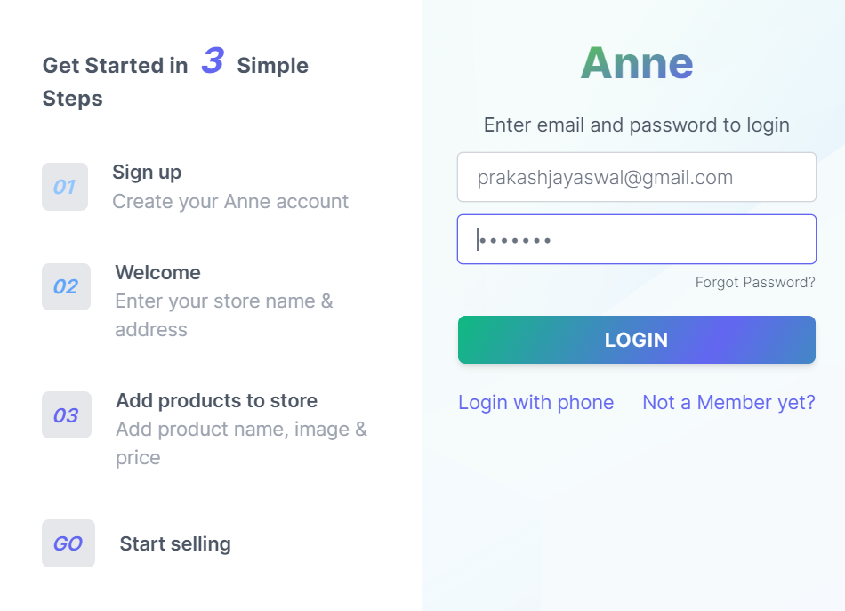
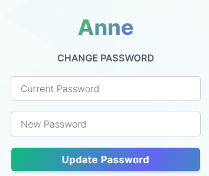
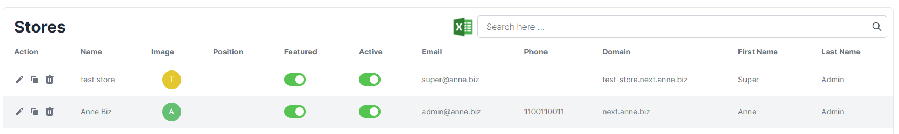

# Super Admin Manual

## Getting started

To access core features on Anne, you have to be a super role user. Only a super user can make a super user. Super users can access major modules like stores.

To be a super user, At first, you have to register as a vendor. An Existing super admin will change your role and verify you.

### Sign In And Sign Out

- You can log in to Anne on your browser.

**To log in**

- Go to the Anne admin panel login page.
- If you signed up with an email address and password, enter them and click `Sign In`.
- password should be case-sensitive.
  

**To log out**

- Go to your Anne admin panel at [https://admin.anne.biz/](https://admin.anne.biz/)
- Click on your left sidebar bottom at logout.

### Dashboard/Reports

When you logged into your account, you will redirect to the dashboard page. The menu page will be listed in the left corner of the page & the 1st option that will be opened is Dashboard.

In the Dashboard, there are different reports that super admin can see such like

**Statistics**

- Total Orders → Total how many orders have been placed from all stores will be shown here as a count.
- Total customers → Total how many users ordered products will be shown here as a count.
  > A user can count only one time, however, he/she placed multiple orders.
- Total products → Total how many products will be shown here as a count.
- Total payments → Total how many payments are done will be shown here as a count.

**Earning** → It will show the total amount of orders placed in a month.

**Latest Orders** → This box will show the latest five orders placed. The latest orders will have a different background color based on the order status.

**Instructional Videos** → This box has a video list, how things work in the panel.

**5 Top Vendors** → This box has a list of top-selling vendors. On top highest selling amount vendor and at bottom lowest selling amount vendor.

**Transactions** → This box will show the latest five payments in the store.

### SideBar

- Anne's sidebar is a useful component of website navigation design. The super admin can see all the services in one place through the Anne sidebar, also can manage as per need.

### Profile

- In the sidebar, go to My Profile → profile.
- Here super admin can update profile information.

- super admin can add its address, This address will use for pick-up locations.

- admin can also close the account from here.

### Change Password

Super admin can change login password via entering a current password and new password. And after successful change super admin will receive a confirmation email.

## User Management

There are multiple types of users on the system. All users get access to different modules based on the permission given by the role they belong to. Only the super admin has control over the website settings.

> Info! You can not access or modify users who have more privilege than you. You can only create users with less privilege than yourself.

### Users

- Super admin can only access user management.
- On the Users listing page, the super admin can see all users and search for a specific user. Super admin can enable or disable any user access on the website.
- A user must have a role to get access to this system.

We have four types of user roles

1. User
2. Vendor
3. Admin
4. Super

- Super admin can assign the store to users, and change the role of the user. Super admin can edit other details also.

  

## Catalog

### Colors

In the color section, there are the colors of the different products that are available in the store can be seen.
Color used for better navigation in product for a customer.

- In the sidebar, go to Products → Colors.

**Create new Color**

- Click on the plus icon to create a new color.
- Now you can fill the form of color.
- Color Code is a unique code, duplicate color code is not allowed.
- Click on the save icon on the right side of the bottom.

**Colors List**

- You can edit, clone, and delete color from here.

**Color Export**

- You can export all your colors in the CSV format by going to the manage colors page where the colors grid is displayed. On the right corner of the grid, there is an excel logo from where you can export the CSV which will have grid columns.

### Units

In this section, you can set measurement units and data formats and some platform rules that will be used to control the marketplace.

In the unit section, there are the units of the different products that are available in the store can be seen.
A unit used for better navigation in product for a customer.

- In the sidebar, go to Products → Units.

**Create new Unit**

- Click on the plus icon to create a new unit.
- Now you can fill the form of unit.
- Unit Code is a unique code, duplicate unit code is not allowed.
- Click on the save icon on the right side of the bottom.

**Units List**

- You can edit, clone, and delete the unit from here.

**Unit Export**

- You can export all your units in the CSV format by going to the manage units page where the units grid is displayed. On the right corner of the grid, there is an excel logo from where you can export the CSV which will have grid columns.

## Configurations

### Global Email Template

An email template is an HTML file composed of reusable code modules, making it as easy as copying and pasting your copy, links, and image URLs to create an email.

Email templates for global as follows

1. Subscription Activation
2. Store Verification
3. Verify Email
4. Change Password
5. Reset Password
6. Forgot Password
7. Sign Up
8. Refer User

Only super admin can edit these customer templates. And also able to enable and disable.

### Store Settings

**Store Profile**

Super admin can add global currency from here.

**SMS and Email**

In the SMS and email section, the Super admin can enable OTP-based login. Super admin can choose SMS provider. Super admin can also enable or disable email services.

**Images**

Super admin can add CDN URL for website images, so it can be loaded faster. Super admin can also upload logos from here.

**Tracking and Analytics**

Super admin can see the list of all GDPR Data Deletion Requests. And Super admin can confirm GDPR Data Deletion Request.

### Stores

- In the sidebar, go to Settings → Stores.
- Here super admin can see a list of all stores.

- Super admin can edit any store from here, also disable them from here.

## Monitoring

- Monitoring is a feature that allows you to monitor your product.
- In the sidebar, go to monitoring.

**Through this you can see the list of products of**

1. No Stock
2. No Image
3. No Price
4. Invalid Price
5. No Description

- You can edit and delete this product from here.
- You can also add a new product from here via a click on the plus icon.
- You will see a product like these

<!-- ## Manage Vendors

A vendor can register on the merchant landing page and you don’t have to do anything at all. Sometimes you may want to add a vendor from the back office and you can do that! To create a new vendor, you just have to provide some basic information and the system will send an email with instructions to the vendor to complete the registration process. Of course, you have full control to manage vendors from your admin panel.

You can offer a trial period with your subscription plans and also can set if a vendor needs to add a card at the time of registration. Read this article to manage subscription plans.

### Vendor Approval

If you set the VENDOR NEEDS APPROVALS on at the SETTINGS CONFIGURATION section, then every vendor will require manual approval from the admin/platform to get live.

The symbol means the vendor is active and the symbol means need approval. You can click over the symbol to activate or deactivate the vendor. Also, you can use the symbol on the options panel to do the same.

### Vendor Verification

This is one of the most requested features from the customers. This feature will help your marketplace to prevent fraud and gain trust from buyers. A shiny verified badge will be displayed on the side of the vendor name on the marketplace, so the customers will know which vendors are verified.

Vendors can upload the required documents from the profile page and the admin will see the request on the dashboard.

When a vendor uploads documents to verify you’ll see the PENDING VERIFICATIONS box with the number of requests.

Click over the symbol to download the document and do the manual inspection. After you’re satisfied with the submitted documents you need to click over the VERIFY button to complete the action. After you’ve done you can also delete the file using the button to keep your system clean. -->
