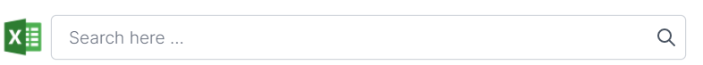

# Super Admin Manual

## Getting started

To access all features on anne, you have be a super role user. Only a super user can create another super user or upgrade to super user.
Super user can access all the major modules like stores.

## Catalog

### Colors

In the color section there are the colors of the different product that are available in the store can be seen.
Color used for better navigation in product for customer.

- In sidebar, go to Products → Colors.

**Create new Color**

- Click on plus icon for create new color.
- Now you can fill form of color.
- Color Code is a unique code, duplicate color code not allowed.
- Click on save icon at right side of bottom.

**Colors List**

- You can edit,clone and delete color from here.

**Color Export**

- You can export all yours colors in the csv format by going to the manage colors page where the colors grid is displayed. On the right corner of the grid there is an excel logo from where the you can export the csv which will have grid columns.

## Configurations

### Units

In this section, you can set measurement units and data formats and some platform rules that will be used to control the marketplace.

In the unit section there are the units of the different product that are available in the store can be seen.
Unit used for better navigation in product for customer.

- In sidebar, go to Products → Units.

**Create new Unit**

- Click on plus icon for create new unit.
- Now you can fill form of unit.
- Unit Code is a unique code, duplicate unit code not allowed.
- Click on save icon at right side of bottom.

**Units List**

- You can edit,clone and delete unit from here.

**Unit Export**

- You can export all yours units in the csv format by going to the manage units page where the units grid is displayed. On the right corner of the grid there is an excel logo from where the you can export the csv which will have grid columns.

### Sync

In this section, you will sync images with the server, sync auto complete, and sync with es etc.

- In sidebar , go to Settings → Sync.

## Utilities

Utility is an important characteristic of business is the creation of utilities is goods so that consumers may use them.

### Pages

- A page is used for Search engine optimization, which is the process of improving the quality and quantity of website traffic to a website or a web page from search engines.
- In sidebar, go to Utilities → Pages.
- You will see the list of pages here.

**Create/Edit Page**

- For create page click on add icon at the bottom of right side, and it will redirect to page edit page.
- Now you can able to create page.
- For edit page click on pencil icon of page on the listing page and you will redirect to page edit page.
- After update details click on save icon.

**Page Export**

- You can export all yours pages in the csv format.
- Click on top right corner at excel logo of the listing page.
- And a csv formatted file will download in your system, which will have data in grid columns.

## Stores

- In sidebar, go to My Profile → Store.
- Here you can see list of all stores.
- You can also close edit any store from here.

**Attach User to Store**

- you can attach any user to any store .
- You have to click on plus icon of stores listing page.

