# Vendor Manual

## Getting started

To sell your products on anne, you have to register as a vendor. You have to visit the vendor page to register as a vendor.

Vendor(seller) can control their store by the easy to handle dashboard. Vendor has the ability to manage sales,products,orders,payments,customers,import and export,monitoring etc. vendor can also see the analysis reports of the performance of the store.

### Dashboard/Reports

You can visit the dashboard page only After successfully loggedIn, Menu page will be listed in the left corner of the page & the 1st option that will be opened is Dashboard.

In the Dashboard there are different reports that we can see such like

- Total Orders→ Total how many orders have been placed for vendor’s products will be shown here as a count.
- Total users→ Total how many users in store will be shown here as a count.
- Total products→ Total how many products in store will be shown here as a count.
- Total payments→ Total how many payments done in store will be shown here as a count.
- Earning→ It will show the total amount of orders placed in a month.
- Latest Orders→ This block will show the latest five orders placed on the store for the vendor’s products. Latest orders will have a different background color on the basis of the order status.
- Transactions→ This block will show the latest five payments on the store for the vendor’s products.

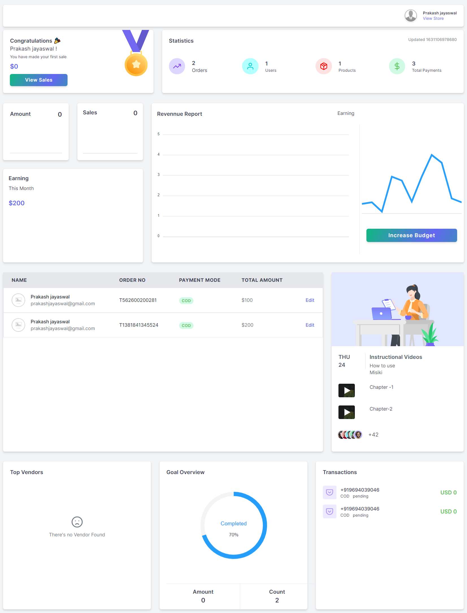

### SideBar

- Anne sidebar is a useful component of website navigation design. You can see all the service in one place through the anne sidebar, you can manage as per need.

### Profile

- In sidebar, go to My Profile → profile.
- Here you can update your profile information.
- You can also close your account from here.

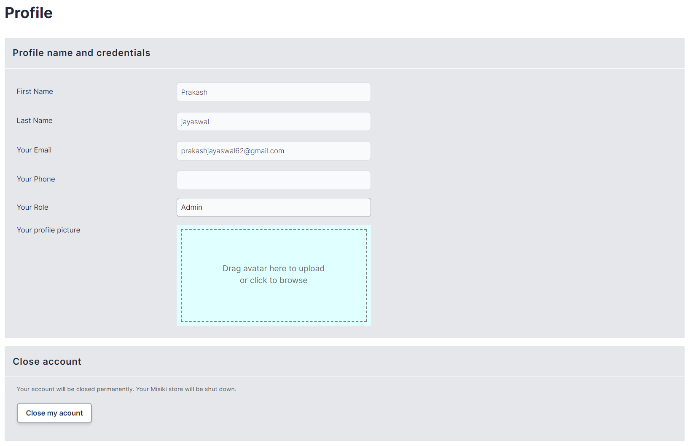

## My Sales

### Orders

#### Search and filter orders

- Orders can be found in the left sidebar on “mysales → Orders” link.

- By default, your orders list is organized from relevance. If you have a large number of orders, then you can use the search bar above the order list to find an order by customer detail, order id.

- You can also filter your orders by

  - Date
  - Payment status
  - Payment mode
  - filter through the status

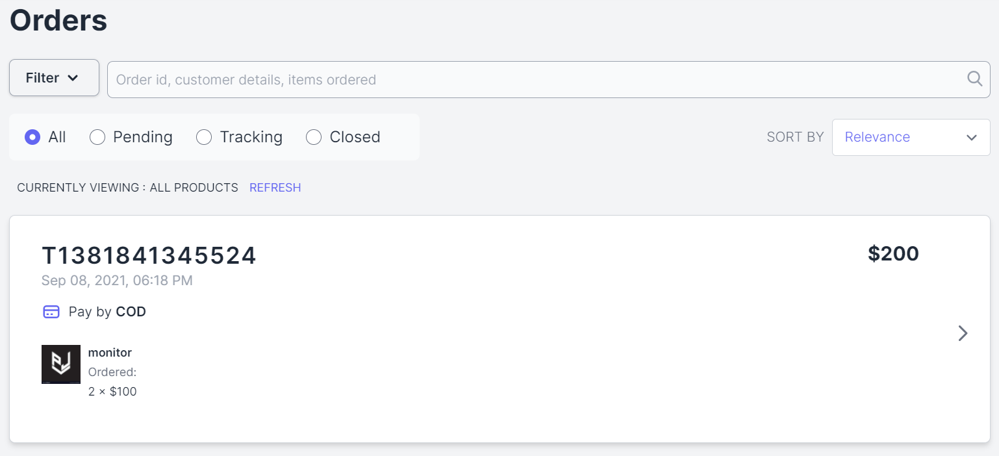

#### Update order

In Order list when click on any order right at arrow sign.

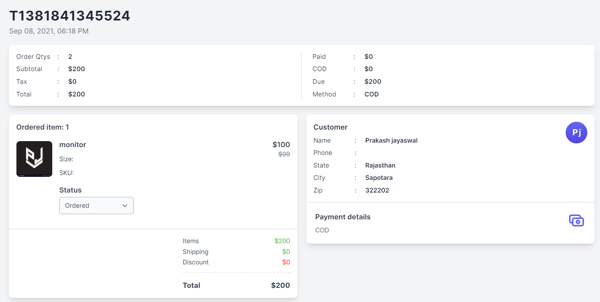

- The order view page of the vendor is shown above. Here different block are available which
  show all the information related to the order.

**Order Details**

- Order No-> It will show the order Number in top left corner start from 'T'.
- Order Date & Time-> Date and time on which the order was placed on the site.
- Order Qtys-> It will show the total qty of the order.
- Subtotal-> It will show the total amount of item without tax, shipping charge and discount of the order.
- Tax-> It will show the total tax of the order.
- Total-> It will show the total amount items, tax, shipping charge and discount of the order.
- Paid-> It will show the total paid ampount of the order.
- COD-> It will show the total cod amount (only in cod case) of the order.
- Due-> It will show the total due amount of the order.
- Method-> It will show the payment method of the order.

- Ordered item-> This information will show how many products are ordered with there amount ,quantity and status
- Status-> In order status vendor can update the status of the order.

- Customer-> Name and address of the customer will show up in this block.
- Payment Details-> The payment method selected to place the order.

#### Create Order

Sometimes you may need to create an order from the admin panel. Yes, you can do it! The system has an easy to use interface with all needed features to create an order.

Go to orders and then click over the CREATE ORDER. Next screen finds the customer you want to create the order for. Type the name/email/nice name, the result will show up soon. Select the customer and click PROCEED button to populate the order form. In same way you have to select the products, you can select multiple products.

The order creation screen is self-descriptive. You can save the order to proceed later by choosing SAVE AND BACK or you can choose PLACE THE ORDER to process the order right way.

### Abandoned Carts

- Abandonment Carts is an ecommerce feature where vendor can see all the abandoned cart ,and m anage them.
- Abandoned cart is cart of customers who add items to their online shopping cart, but exit without completing the purchase.

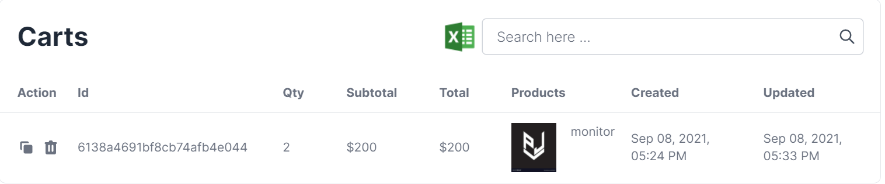

- You can use the searchbar for filter.

**Cart Export**

- You can export all yours carts in the csv format by going to the manage abandoned cart page where the cart grid is displayed. On the right corner of the grid there is an excel logo from where the you can export the csv which will have grid columns.

### Payments

#### Payment List

- Payment section shows the payments list with details about the order customer have placed through the account.
- It gives us the information about the customer , payment status and orderId.

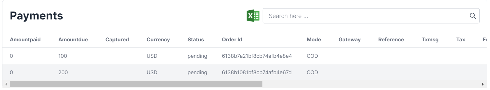

- You can use the searchbar for filter.

**Payment Export**

- You can export all yours payments in the csv format by going to the list page where the payment grid is displayed. On the right corner of the grid there is an excel logo from where the you can export the csv which will have grid columns.

**Payment attribues**

- Amountpaid->It will show the amount that has been paid to the user.
- Amountdue->It will show the amount that has been due to the user.
- Captured->It will show the amount that has been captured via the user.
- Currency-> It will show the currency of amount.
- Status-> It will show the status of the payment.
- Order Id-> It will show the order id of the payment.
- Mode->It will show the payment mode to the user i.e. by which mode
- the payment has been made to the user. like cod, online
- Gateway->It will show the payment gateway used to paid.
- Reference
- Txmsg-> It will show the transaction message.
- Tax->It will show the tax amount.
- Fee-> It will show the transaction fee.
- Txtime-> It will show the transaction time.
- Email-> It will show the email address of the user.
- Contact-> It will show the contact address of the user.
- Invoice No-> It will show the invoice number of the order.
- Error Code-> It will show the error if failed.
- Error Description-> It will show the error description of the error.
- Date-> It will show the date on which the customer has made the payment.

### Wishlists

- Wishlist is a simple listing feature available on Anne app, It lets customer to add and collect all the items that customer wish to purchase. All the products that customer want to own can now be put up in one easy-to-reach destination.

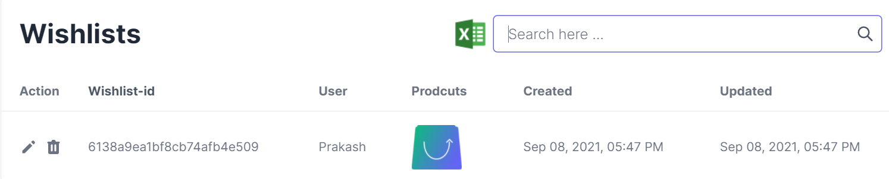

- You can use the searchbar for filter.

**Wishlist Export**

- You can export all yours wishlist in the csv format by going to the list page where the wishlist grid is displayed. On the right corner of the grid there is an excel logo from where the you can export the csv which will have grid columns.

<!-- ## Manage Vendors

A vendor can register on the merchant landing page and you don’t have to do anything at all. Sometime you may want to add a vendor from the back office and you can do that! To create a new vendor, you just have to provide some basic information and the system will send an email with instructions to the vendor to complete the registration process. Of course, you have full control to manage vendors from your admin panel.

You can offer a trial period with your subscription plans and also can set if a vendor needs to add a card on the time of registration. Read this article to manage subscription plans.

### Vendor Approval

If you set the VENDOR NEEDS APPROVALS on at SETTINGS CONFIGURATION section, then every vendor will require manual approval from admin/platform to get live.

The sysmol means the vendor is active and the sysmol means need approval. You can click over the symbol to activate or deactivate the vendor. Also you can use the symbol on the option panel to do the exact same.

### Vendor Verification

This is one of the most requested features from the customers. This feature will help your marketplace to prevent fraud and gain trust from buyers. A shiny verified badge will be displayed on the side of vendor name on the marketplace, so the customers will know which vendors are verified.

Vendors can upload the required documents from the profile page and admin will see the request on the dashboard.

When a vendor uploads documents to verify you’ll see the PENDING VERIFICATIONS box with the number of requests.

Click over the symbol to download the document and do manual inspection. After you’re satisfied with the submitted documents you need to click over the VERIFY button to complete the action. After you’ve done you can also delete the file using the button to keep your system clean. -->

## Customers

#### User List

- In the customer section you can see the list of all users who registered on your store.

- Through this you can easily contact users by the phone number and other details like their mail id and the designation that they are bearing here.

- You can export the users list in csv format via click on sheet logo.
- You can see photo of every user that is active and are performing any role in the website.
- You can verified and active the user from here.

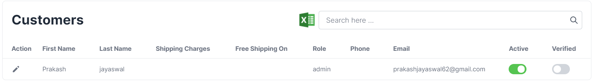

#### Searching and Export customers

- Use the Search bar on the Customers page to search for customer name and email.

**To search customers**

- In sidebar, go to Customers.
- Search for a full name or email address.

**To export customers**

- You can export the whole of your customer list.

**To export specific customer list**

- In sidebar, go to Customers page.
- Click on the Excel logo.
- As a result, a CSV file will be downloaded to your computer.

#### Edit Customers

You can change an existing customer profile to update their information.

**To edit a customer’s information**

- In sidebar, go to Customers.
- Click the pencil icon of the customer profile you want to edit.
- In the Edit customer dialog, you can change a customer’s

  - firstName and lastName
  - email address
  - Shipping Charges(in role vendor)
  - Free Shipping On(in role vendor)
  - Role
  - active and verified
    Click Save to confirm your changes

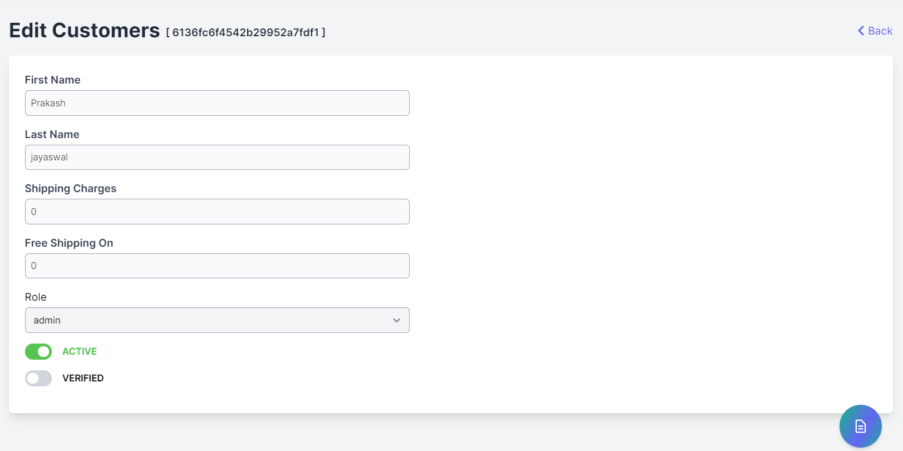

## Catalog

The catalog is combined of product, category, product attribute and manufacturer modules. With the help of this modules, you will be able to manage your marketplace product catalog effortlessly. All the functionalities you need is there.

### Products

Products are the physical goods, digital files, and services that you sell. To create a product, you need to specify the name and upload product images. In addition, you can add product details that help your clients better understand the product. For example add available sizes, SKU, description, etc. You don't have to provide every detail for each product.

- In sidebar, go to Products → All Products.
- You can view and edit product details from here.

#### Adding a new product

- In sidebar, go to Products → All Products → Add New Product.
- Click on Add New Product button and it will redirect to product edit page.

##### Images/Video

- In this section images show your customers what your products look like. Here you can upload images of front, side, underneath, close-up, etc., so customers can see what they are buying in detail.
- The quality of your product images directly affects your ability to generate sales. Here are some tips

  - Each product image should be of uniform size and style across all products you sell.
  - Use high-quality images, so customers can see any fine details.

- For add Video link

  - Click on `Add Image/Youtube Link` at top right corner of the box and a small window pop up came, and here you can provide youtube link and click on submit.
  - Video will be added to your product

> Note - while uploading image, restricted platfrom url not allowed, like google dive and dropbox

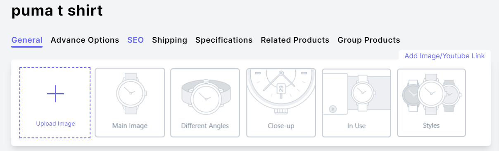

##### Name and description

**Name**

Name is a title for your product. When you name a product you should automatically make customers think about the most valuable components of your product, and what they can get when they buy from you.

**Description**

It emphasizes its advantages, lists its characteristics, or highlights product features. You may also use videos, images, and animated elements that help to describe your product. Write unique product descriptions so they rank higher in search engines.

Tips to improve your product descriptions

- Avoid long sentences and complex vocabulary, Imagine you are explaining the product to a child.
- Include product demo videos, Just by watching a person hold, touch, and interact with the product while explaining its pros and cons is the next best thing to visiting a store.
- Provide a short and long version of your description, Some people scan rather than read, some like to read more in-depth about your product, make sure you cover both types.

**Brand**

In brand you will have option for select brand, you can also create new brand via click on "Add New" button.

**Size**

In size you will have to choose size, you can also create new size in case your needy size is not available, then click `Add New` button. And you will be able to create it.

**Color**

In color section you can choose any color from board.

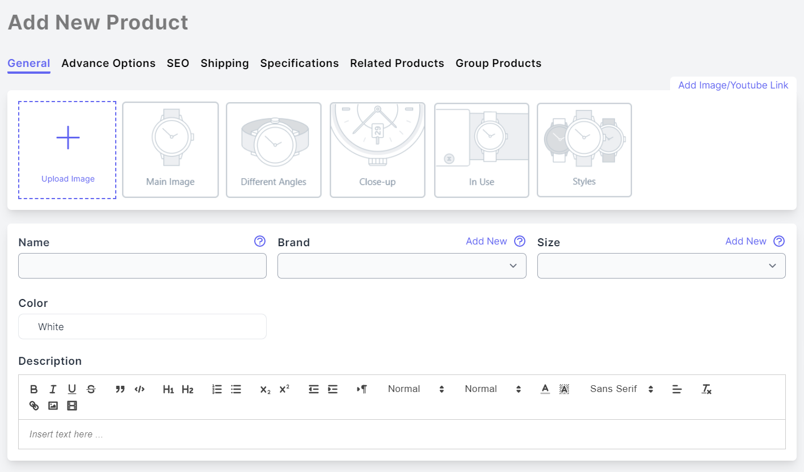

#### Advance Option

This section has some mini sections as follows

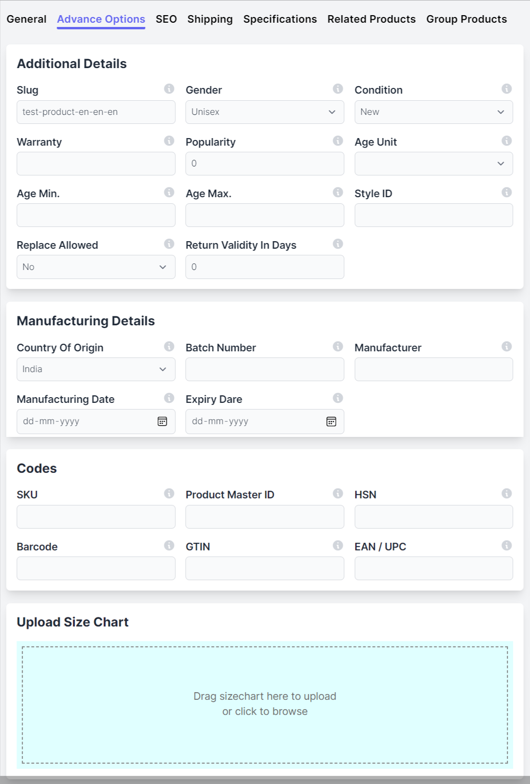

- In this section you can add fields
  Gender-> The gender of the product.
  Condition-> The condition of the product.(new/old/refurnished)
  Warranty-> The warranty of the product.
  Popularity-> Integer ranking 0 to --
  Age Min and Age Max-> If product is for specific age limit

##### Manufacturing Details

- In this you can select fields as follows
  Country Of Origin-> The country of origin of the product.
  Batch Number-> The batch number of the product.
  Manufacturer-> The manufacturer of the product
  Manufacturing Date-> The manufacturer of the product.
  Expiry Date-> Expiry of the product.

##### CODES

Code are very important fields in the product, because they identifies the product.

**SKU (stock keeping unit)**

The code that identifies the product within your business. You can use the product identification code provided by manufacturers or your own combinations of letters and numbers. Each SKU needs to be unique.

**Product master ID**

Product master id used for , when a product have options,like- multiple colors ,multiple sizes and more , then we will will save this unique id in all of common product. So product can be grouped easily.

**HSN**

Harmonized System of Nomenclature code (HSN Code) is used for classifying goods under GST.

**Barcode**

Barcodes are applied to products to quickly identify them. Among their many uses. In warehouses to track and manage inventory and on invoices to help with accounting.

**GTIN**

The Global Trade Item Number is an identifier for trade items, developed by GS1. Such identifiers are used to look up product information in a database which may belong to a retailer

**EAN / UPC**

EAN is a standardized barcode and marked on most commercialized products currently available at the stores

##### Size Chart

- Sizechart is a image, Size in general is the magnitude or dimensions of a thing.
- Gometrical size can refer to linear dimensions, area, or volume.
- Size can also be measured in terms of mass, especially when assuming a density range.

#### Product SEO

These settings allow you to set specific SEO-related information on your product's page. When analyzing a webpage, search engines get information about its content from the so-called “meta tags”. This includes the page title and meta description. Search engines use meta tags to describe pages as they appear in the search results and rank them by relevance.

Anne automatically generates metadata based on your product's name and its description. Search engines display a limited number of characters, so you may want to re-write the page title and meta description. Edit page title and descriptions with relevant keywords so your product appears higher in search engine results.

**Page title**

The title is shown as a clickable link in search results. You can customize the title to target your clients’ interests more accurately.

**Meta description**

A short sentence summarizing the content of the product. Write a more detailed text describing your product offer. Meta descriptions can be any length, but Google generally truncates snippets to ~155–160 characters.

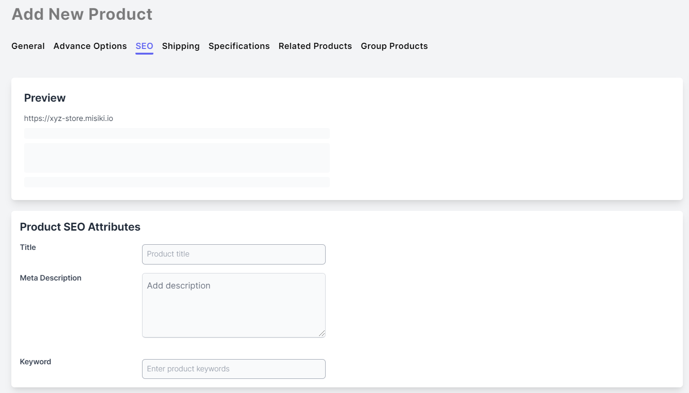

#### Shipping

This section will need in physical product only.

**Weight and Dimensions**

The product's actual weight and dimensions.

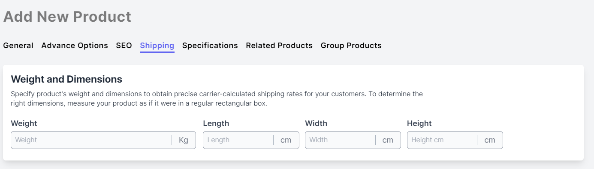

#### Specifications

Product categories have some attributes and when product select the category , then product have access of that category attributes.

For ex- Television categories have attributes like- In the box, charger type.
Whenever you select the Television category , it will automatically show all the attributes of the category, and then you can easily fill them.

**Add specifications for product**

- Select Attribute Type(categories) from the drop down. If there is no attribute then create it via click on Add New feature.
- After selecting the attribute type, now select the feature and fill the value of the feature.

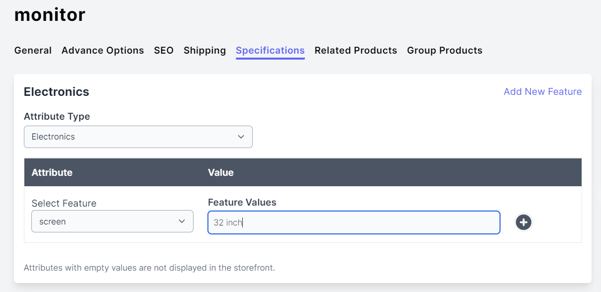

#### Related products

Some products complement each other well and it’s best to buy them together. Use the related products feature to display the You may also like section in your online store as well as to cross-sell products in the cart. This feature helps you promote certain products and encourages customers to buy more.

- In sidebar, go to Products.
- Open the product page where you wish to recommend related products.
- Open the Related Products tab.

**Display specific and random products**

- In specific product you can selct the product .
- If you want random product then you can enable the button of Display random products.

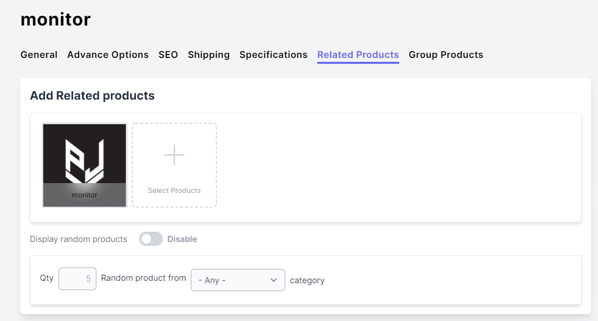

#### Group Products

- When two or more products have common master id then other products will shown here with images.
- On click of product ,you can move to those edit page also.

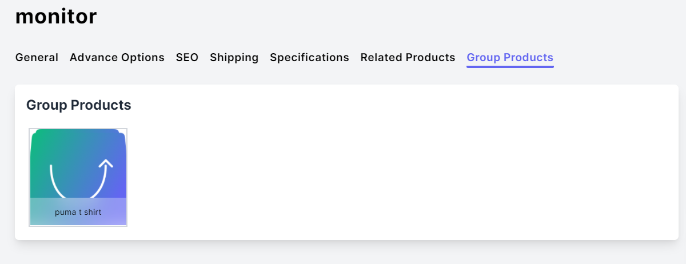

#### Product Pricing

**Discount Price**

A price that you're charging for the product.

**Price**

A price is mrp(marketing price).

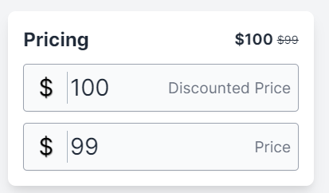

#### Product Categories

- In product edit, go to right bottom categories section.

  - Categories help customers to faster navigate through the store and find the products as per their need.
  - Categories are groups of products that a product is included in. The product can be assigned to one category or several categories.

- In this section choose the categories.

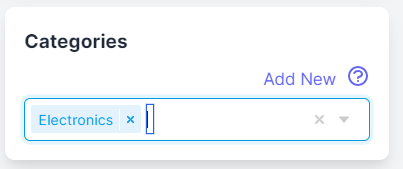

#### Product ribbons

- In product edit, go to right bottom Product Ribbons section.

- Product ribbons are colored labels that are displayed in your catalog above product images. They can help visually highlight certain products on your storefront. These tags contain your custom text.

**You have for ribbons to edit**

- Active
- Featured
- Hot
- New
- Sale

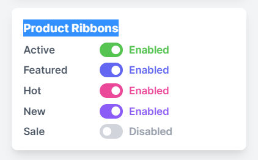

#### Product Inventory

**Stock Control**

- If you have a limited number of this product to sell, use the stock control section to specify the quantity in stock.

#### Product Preview in store

Click Preview Product to see how this product will look in your online store.

### Reviews

Review is the nothing but a comment box in which customers give their reviews about the product that they have ordered & used. In this the customer gives some ratings to the product in a form of stars and message.

- In sidebar, go to Products → Reviews.

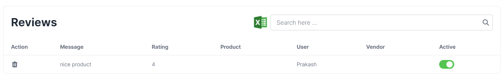

- You can disable and delete review from here.

**Review Export**

- You can export all yours reviews in the csv format by going to the manage reviews page where the review grid is displayed. On the right corner of the grid there is an excel logo from where the you can export the csv which will have grid columns.

## Monitoring

- Monitoring is feature which allows you to monitor your product.
- In sidebar, go to monitoring.

**Through this you can see the list of products of**

1. No Stock
2. No Image
3. No Price
4. Invalid Price
5. No Description

- You can edit and delete these product from here.
- You can also add new product from here via click on plus icon.
- You will see product like these

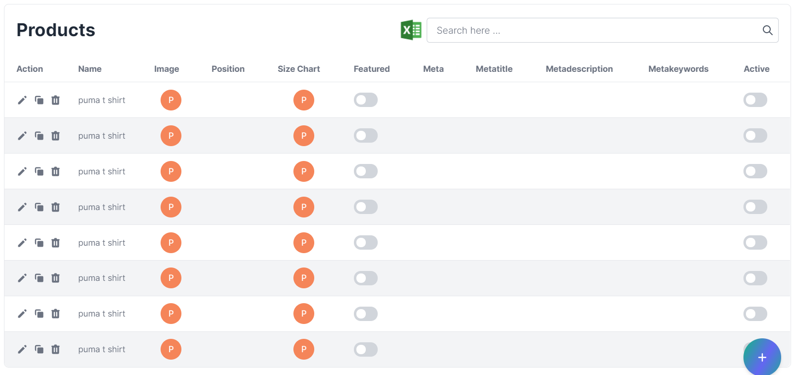
