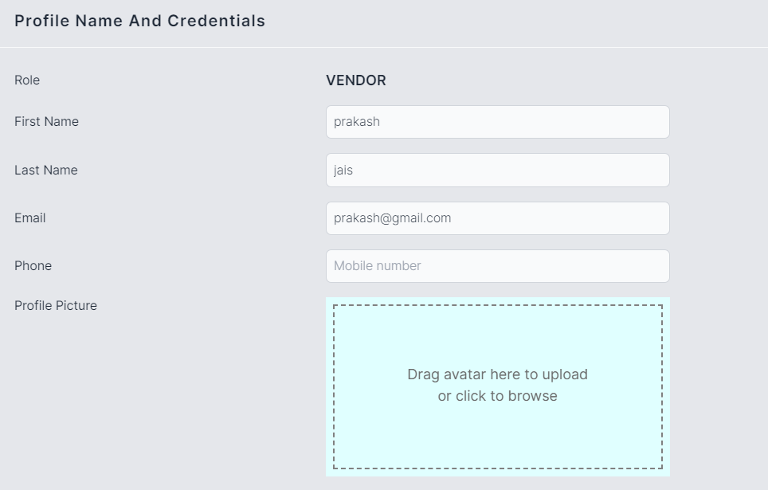
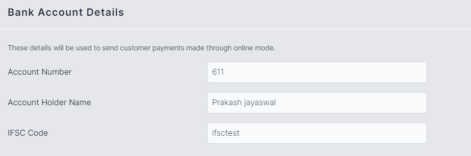
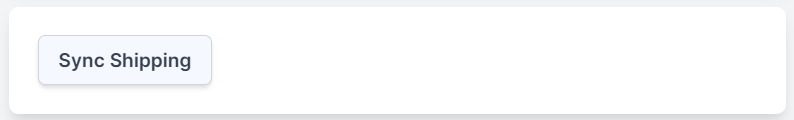
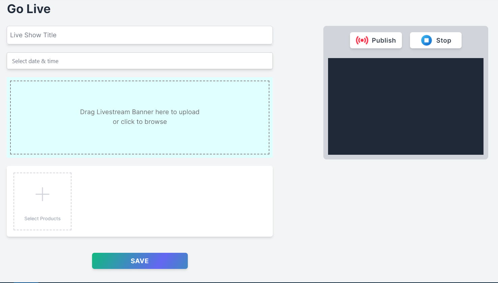
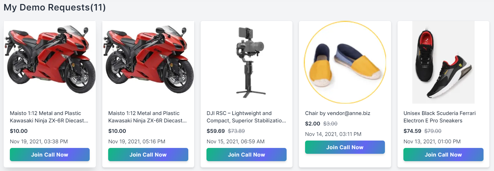

# Vendor Manual

## Getting started

To sell your products on Anne, you have to register as a vendor. Vendor(seller) can control their store by the easy-to-handle dashboard. The vendor can manage sales, products, orders, payments, customers, import and export, monitoring, etc. vendor can also see the analysis reports of the performance of the store.

To register as a vendor You have to go to the store, And at the bottom, you will see an option for `become a vendor`. Click on that link And It will redirect you to the vendor registration page.

### SignUp

- You can sign up to Anne Platform on your browser. All you need is a valid email address, and You can set up an account.
- If you are not registered to the website then you can create a new account using sign up.
- After filling in all details, click on the `sign up` button, this server will check the provided info is valid or not, if it is valid then it will create your account or if it detects that the info is invalid then you have to fill the details carefully.
- Email must be unique, not registered with us already.
- You can fill in details as in the image below

**Vendor Set up**

After vendor registration, it will redirect to the setup page, where the vendor has to fill in details about the business, like- address. Super admin will allow a store to vendor. And the vendor will be able to access that store.

### Sign In And Sign Out

- You can log in to Anne on your browser.

**To log in**

- Go to the Anne admin panel login page.
- If you signed up with an email address and password, enter them and click `Sign In`.
- password should be case-sensitive.
  

**To log out**

- Go to your Anne admin panel at [https://admin.anne.biz/](https://admin.anne.biz/)
- Click on your left sidebar bottom at logout.

### Dashboard/Reports

When the super admin assigns the store to the vendor, the vendor will receive a confirmation email. And Vendor can visit the dashboard page only After successfully logging in, the Menu page will be listed in the left corner of the page & the 1st option that will be opened is Dashboard.

In the Dashboard, there are different reports that vendors can see such like

**Statistics**

- Total Orders → Total how many orders have been placed from vendor products will be shown here as a count.
- Total customers → Total how many users ordered vendor products will be shown here as a count.
  > A user can count only one time, however, he/she placed multiple orders.
- Total products → Total how many products are owned by the vendor will be shown here as a count.
- Total payments → Total how many payments are done in vendor products will be shown here as a count.

**Earning** → It will show the total amount of orders placed in a month of vendor products.

**Latest Orders** → This box will show the latest five orders placed on the store from vendor products. The latest orders will have a different background color based on the order status.

**Instructional Videos** → This box has a video list, how things work in the panel.

**5 Top Vendors** → This box has a list of top-selling vendors in the store. On top highest selling amount vendor and at bottom lowest selling amount vendor.

**Transactions** → This box will show the latest five payments on the store from vendor orders.

### SideBar

- Anne sidebar is a useful component of website navigation design. The vendor can see all the services in one place through the Anne sidebar, also can manage as per need.

### Profile

- In the sidebar, go to My Profile → profile.
- Here vendor can update profile information.

- Vendor can add its address, This address will use for pick-up locations.

- Vendor can add bank account details.

> Please make sure details are correct because these details will use in case of payment withdrawal.

- Vendor can set up a separate banner for itself.

- Vendor can also close the account from here.

### Change Password

The vendor can change the login password via entering the current password and new password. And after successful change vendor will receive a confirmation email.

## My Sales

### Orders

#### Search and filter orders

- Orders can be found in the left sidebar on the “my sales → Orders” link.

- By default, the orders list is organized from relevance. If there is a large number of orders, then you can use the search bar above the order list to find an order by customer detail, order id.

- You can also filter your orders by

  - Date
  - Payment status
  - Payment mode
  - filter through the status

#### Update order

In the Order list when clicking on any order right at the arrow sign.

- The order view page of the vendor is shown above. Here different blocks are available which
  show all the information related to the order.

**Order Details**

- Order No-> It will show the order number in the top left corner starting from 'T'.
- Order Date & Time-> Date and time on which the order was placed on the site.
- Order Qty-> It will show the total qty of the order.
- Subtotal-> It will show the total amount of items without tax, shipping charge, and discount of the order.
- Tax-> It will show the total tax of the order.
- Total-> It will show the total amount items, tax, shipping charge, and discount of the order.
- Paid-> It will show the total paid amount of the order.
- COD-> It will show the total cod amount (only in cod case) of the order.
- Due-> It will show the total due amount of the order.
- Method-> It will show the payment method of the order.

- Ordered item-> This information will show how many products are ordered with their amount, quantity, and status
- Status-> In order status vendor can update the status of the order.

- Customer-> Name and address of the customer will show up in this block.
- Payment Details-> The payment method selected to place the order.

**Sync Shipping**

- At bottom of the left side, a syncShipping button is available, If an order did not sync with the shipping provider for any reason, then you can do it via clicking on this. It will not create make duplicate orders.

<!-- #### Create Order

Sometimes you may need to create an order from the admin panel. Yes, you can do it! The system has an easy-to-use interface with all the needed features to create an order.

Go to orders and then click over the CREATE ORDER. The next screen finds the customer you want to create the order for. Type the name/email/nice name, the result will show up soon. Select the customer and click PROCEED button to populate the order form. In the same way, you have to select the products, you can select multiple products.

The order creation screen is self-descriptive. You can save the order to proceed later by choosing SAVE AND BACK or you can choose PLACE THE ORDER to process the order right away. -->

### Abandoned Carts

- Abandonment Carts is an eCommerce feature where the vendor can see all the abandoned carts, and manage them.
- Abandoned cart is a cart of customers who add items to their online shopping cart, but exit without completing the purchase.

- You can use the search bar for the filter.

**Cart Export**

- You can export all your carts in the CSV format by going to the manage abandoned cart page where the cart grid is displayed. On the right corner of the grid, there is an excel logo from where you can export the CSV which will have grid columns.

### Payments

#### Payment List

- Payment section shows the payments list with details about the order customer has placed through the account.
- It gives us information about the customer, payment status, and orderId.

- You can use the search bar for the filter.

**Payment Export**

- You can export all your payments in the CSV format by going to the list page where the payment grid is displayed. On the right corner of the grid, there is an excel logo from where you can export the CSV which will have grid columns.

**Payment attributes**

- Amountpaid->It will show the amount that has been paid to the user.
- Amountdue->It will show the amount that has been due to the user.
- Captured->It will show the amount that has been captured via the user.
- Currency-> It will show the currency of the amount.
- Status-> It will show the status of the payment.
- Order Id-> It will show the order id of the payment.
- Mode->It will show the payment mode to the user i.e. by which mode
- the payment has been made to the user. like cod, online
- Gateway->It will show the payment gateway used to pay.
- Reference
- Txmsg-> It will show the transaction message.
- Tax->It will show the tax amount.
- Fee-> It will show the transaction fee.
- Txtime-> It will show the transaction time.
- Email-> It will show the email address of the user.
- Contact-> It will show the contact address of the user.
- Invoice No-> It will show the invoice number of the order.
- Error Code-> It will show the error if failed.
- Error Description-> It will show the error description of the error.
- Date-> It will show the date on which the customer has made the payment.

### Wishlists

- Wishlist is a simple listing feature available on the Anne app, It lets customers add and collect all the items that customers wish to purchase. All the products that customers want to own can now be put up in one easy-to-reach destination.

- You can use the search bar for the filter.

**Wishlist Export**

- You can export all your wishlist in the CSV format by going to the list page where the wishlist grid is displayed. On the right corner of the grid, there is an excel logo from where you can export the CSV which will have grid columns.

## Customers

#### User List

- In the customers, section the vendor can see the list of all users who bought items from vendor products.

- Through this vendors can easily contact users by phone number and other details like their mail id and the designation that they are bearing here.

- Vendor can export the user's list in CSV format via a click-on sheet logo.
- Vendor can see a photo of every user that is active and is performing any role in the website.
- Vendor verified and active the user from here.

#### Searching and Export customers

- Use the search bar on the Customers page to search for customer name and email.

**To search customers**

- In the sidebar, go to Customers.
- Search for a full name or email address.

**To export customers**

- Vendor can export the whole customer list.

**To export specific customer list**

- In the sidebar, go to the Customers page.
- Click on the Excel logo.
- As a result, a CSV file will be downloaded to the vendor's computer.

## Catalog

A catalog is combined of products and reviews. With the help of these modules, vendors will be able to manage marketplace products effortlessly. All the functionalities vendor need is there.

### All Products

Products are the physical goods, digital files, and services that you sell. To create a product, you need to specify the name and upload product images. In addition, you can add product details that help your clients better understand the product. For example add available sizes, SKU, description, etc. You don't have to provide every detail for each product.

Physical item has weight and needs shipping or customer pickup. Digital item is delivered digitally or provided as a service.

- In the sidebar, go to Products → All Products.
- You can view and edit product details from here.

#### Adding a new product

- In the sidebar, go to Products → All Products → Add New Product.
- Click on Add New Product button and it will redirect to the product edit page.

##### Images/Video

- In this section images show your customers what your products look like. Here you can upload images of the front, side, underneath, close-up, etc., so customers can see what they are buying in detail.
- The quality of your product images directly affects your ability to generate sales. Here are some tips

  - Each product image should be of uniform size and style across all products you sell.
  - Use high-quality images, so customers can see any fine details.

- For add Video link

  - Click on `Add Image/Youtube Link` at the top right corner of the box and a small window pop-up came, and here you can provide a youtube link and click on submit.
  - Video will be added to your product

> Note - while uploading an image, restricted platform URL not allowed, like google drive and dropbox

##### Name and description

**Name**

Name is a title for your product. When you name a product you should automatically make customers think about the most valuable components of your product, and what they can get when they buy from you.

**Description**

It emphasizes its advantages, lists its characteristics, or highlights product features. You may also use videos, images, and animated elements that help to describe your product. Write unique product descriptions so they rank higher in search engines.

Tips to improve your product descriptions

- Avoid long sentences and complex vocabulary, Imagine you are explaining the product to a child.
- Include product demo videos, Just watching a person hold, touch, and interact with the product while explaining its pros and cons is the next best thing to visiting a store.
- Provide a short and long version of your description, Some people scan rather than read, some like to read more in-depth about your product, make sure you cover both types.

**Brand**

In brand you will have an option for the select brand, you can also create a new brand via clicking on the `Add New` button.

**Size**

In size you will have to choose size, you can also create a new size in case your needy size is not available, then click the `Add New` button. And you will be able to create it.

**Color**

In the color section, you can choose any color from the board.

#### Advance Option

This section has some mini sections as follows

##### Additional Details

- In this section, you can add fields
  Gender-> The gender of the product.
  Condition-> The condition of the product.(new/old/refurbished)
  Warranty-> The warranty of the product.
  Popularity-> Integer ranking 0 to --
  Age Min and Age Max-> product is for a specific age limit

##### Manufacturing Details

- In this, you can select fields as follows
  Country Of Origin-> The country of origin of the product.
  Batch Number-> The batch number of the product.
  Manufacturer-> The manufacturer of the product
  Manufacturing Date-> The manufacturer of the product.
  Expiry Date-> Expiry of the product.

##### CODES

Code is a very important field in the product because they identify the product.

**SKU (stock keeping unit)**

The code that identifies the product within your business. You can use the product identification code provided by manufacturers or your combinations of letters and numbers. Each SKU needs to be unique.

**Product master ID**

Product master id used for, when a product has options, like- multiple colors, multiple sizes, and more, then we will save this unique id in all of the common products. So products can be grouped easily.

**HSN**

Harmonized System of Nomenclature code (HSN Code) is used for classifying goods under GST.

**Barcode**

Barcodes are applied to products to quickly identify them. Among their many uses. In warehouses to track and manage inventory and on invoices to help with accounting.

**GTIN**

The Global Trade Item Number is an identifier for trade items, developed by GS1. Such identifiers are used to look up product information in a database that may belong to a retailer

**EAN / UPC**

EAN is a standardized barcode and marked on most commercialized products currently available at the stores

##### Size Chart

- Sizechart is an image, Size in general is the magnitude or dimensions of a thing.
- Geometrical size can refer to linear dimensions, area, or volume.
- Size can also be measured in terms of mass, especially when assuming a density range.

#### Product SEO

These settings allow you to set specific SEO-related information on your product's page. When analyzing a webpage, search engines get information about its content from the so-called “meta tags”. This includes the page title and meta description. Search engines use meta tags to describe pages as they appear in the search results and rank them by relevance.

Anne automatically generates metadata based on your product's name and its description. Search engines display a limited number of characters, so you may want to re-write the page title and meta description. Edit page title and descriptions with relevant keywords so your product appears higher in search engine results.

**Page title**

The title is shown as a clickable link in search results. You can customize the title to target your clients’ interests more accurately.

**Meta description**

A short sentence summarizing the content of the product. Write a more detailed text describing your product offer. Meta descriptions can be any length, but Google generally truncates snippets to ~155–160 characters.

#### Shipping

This section will need physical products only.

**Weight and Dimensions**

The product's actual weight and dimensions.

#### Specifications

Product categories have some attributes and when the product selects the category, then the product has access to that category attributes.

For ex- Television, categories have attributes like- In the box, charger type.
Whenever you select the Television category, it will automatically show all the attributes of the category, and then you can easily fill them.

**Add specifications for product**

- Select Attribute Type(categories) from the drop-down. If there is no attribute then create it via a click on Add New feature.
- After selecting the attribute type, now select the feature and fill in the value of the feature.

#### Related products

Some products complement each other well and it’s best to buy them together. Use the related products feature to display the You may also like section in your online store as well as to cross-sell products in the cart. This feature helps you promote certain products and encourages customers to buy more.

- In the sidebar, go to Products.
- Open the product page where you wish to recommend related products.
- Open the Related Products tab.

**Display specific and random products**

- In a specific product, you can select the product.
- If you want a random product then you can enable the button of Display random products.

#### Group Products

- When two or more products have a common master id then other products will be shown here with images.
- On click of product, you can move to those edit page also.

#### Product Pricing

**Discount Price**

A price that you're charging for the product.

**Price**

A price is MRP(marketing price).

#### Product Categories

- In product edit, go to the right bottom categories section.

  - Categories help customers to faster navigate through the store and find the products as per their needs.
  - Categories are groups of products that a product is included in. The product can be assigned to one category or several categories.

- In this section choose the categories.

#### Product ribbons

- In product edit, go to the right bottom Product Ribbons section.

- Product ribbons are colored labels that are displayed in your catalog above product images. They can help visually highlight certain products on your storefront. These tags contain your custom text.

**You have for ribbons to edit**

- Active
- Featured
- Hot
- New
- Sale

#### Product Inventory

**Stock Control**

- If you have a limited number of this product to sell, use the stock control section to specify the quantity in stock.

#### Product Preview in store

Click Preview Product to see how this product will look in your online store.

### Reviews

Review is nothing but a comment box in which customers give their reviews about the product that they have ordered & used. In this, the customer gives some ratings to the product in a form of stars and messages.

- In the sidebar, go to Products → Reviews.

- You can disable and delete the review from here.

**Review Export**

- You can export all your reviews in the CSV format by going to the manage reviews page where the review grid is displayed. On the right corner of the grid, there is an excel logo from where you can export the CSV which will have grid columns.

## Monitoring

- Monitoring is a feature that allows you to monitor your product.
- In the sidebar, go to monitoring.

**Through this you can see the list of products of**

1. No Stock
2. No Image
3. No Price
4. Invalid Price
5. No Description

- You can edit and delete this product from here.
- You can also add new products from here via clicking on the plus icon.
- You will see products like these

## Live Streaming

Live Streaming is a feature that allows a vendor to live communicate with customers, So customers can better understand products.

### Go Live

- In the sidebar, go to Live Streaming → Go Live.

  

- Vendor can see a list of channels. The vendor can edit details and also can go live from here.

  

### Demo Requests

- In the sidebar, go to Live Streaming → Demo Requests.
- Vendor can see a list of demo requests which was created via customers.
- Vendor also joins calls and also go live through here.

